#  Linux（正点原子驱动）

## Makefile

**格式**


**注意**

命令列表中的每条命令必须以 TAB 键开始，不能使用空格！


clean一般情况下不会执行，只有手动调用;make clean,以此完成工程的清理

**变量支持**

```
1 #Makefile 变量的使用
2 objects = main.o input.o calcu.o
3 main: $(objects)
4 gcc -o main $(objects)
```

**通配符**

%”表示长度任意的非空字符串，比如“%.c”就是所有的以.c 结尾的

文件，类似与通配符，a.%.c 就表示以 a.开头，以.c 结束的所有文件。

```
%.o : %.c
命令（自动化变量）
```


```
1 objects = main.o input.o calcu.o
2 main: $(objects)
3 gcc -o main $(objects)
4 
5 %.o : %.c
6 gcc -c $<
7 
8 clean:
9 rm *.o
10 rm main
```

## 链接脚本

规定链接时各段的位置

imx6ul.lds链接脚本文件

```
1 SECTIONS{
2 . = 0X87800000;//设置定位计数器
3 .text :
4 {
5 start.o 
6 main.o 
7 *(.text)
8 }
9 .rodata ALIGN(4) : {*(.rodata*)} 
10 .data ALIGN(4) : { *(.data) } 
11 __bss_start = .; 
12 .bss ALIGN(4) : { *(.bss) *(COMMON) } 
13 __bss_end = .;
14 }
```


## CMake


## Shell

命令记录：/home/.bash_history,保存上次开机运行的指令

命令和文件补全：tab

设置别名（宏定义）：alias lm='ls -al'

**程序化脚本**（shell编程 .sh）：类似Makefile

通配符*

type：查看指令来源，内置bash或是外部

转义符号：\\[Enter]，切换下一行不运行，二者间没有空格

快速删除：

**变量**

用特定字符代替不固定的内容

应用：定义不确定的路径

echo：取变量，结构：echo ${变量名}

变量规则：

 **变量类型缺省为『字符串』**

**bash 环境中的数值运算，缺省最多仅能到达整数形态，所以 1/3 结果是 0；**

1. 变量与变量内容以一个等号『=』来链接，如下所示：
   『myname=VBird』
2. 等号两边不能直接接空白字符，如下所示为错误：
   『myname = VBird』或『myname=VBird Tsai』
3. 变量名称只能是英文本母与数字，但是开头字符不能是数字，如下为错误：
   『2myname=VBird』
4. 变量内容若有空白字符可使用双引号『"』或单引号『'』将变量内容结合起来，但
   - 双引号内的特殊字符如 $ 等，可以保有原本的特性，如下所示：
     『var="lang is $LANG"』则『echo $var』可得『lang is zh_TW.UTF-8』
   - 单引号内的特殊字符则仅为一般字符 (纯文本)，如下所示：
     『var='lang is $LANG'』则『echo $var』可得『lang is $LANG』
5. 可用转义字符『 \ 』将特殊符号(如 [Enter], $, \, 空白字符, '等)变成一般字符，如：
   『myname=VBird\ Tsai』
6. 在一串指令的运行中，还需要借由其他额外的指令所提供的信息时，可以使用反单引号『`指令`』或 『$(指令)』。特别注意，那个 ` 是键盘上方的数字键 1 左边那个按键，而不是单引号！ 例如想要取得内核版本的设置：
   『version=$(uname -r)』再『echo $version』可得『3.10.0-229.el7.x86_64』
7. 若该变量为扩增变量内容时，则可用 "$变量名称" 或 ${变量} 累加内容，如下所示：
   『PATH="$PATH":/home/bin』或『PATH=${PATH}:/home/bin』
8. 若该变量需要在其他子进程运行，则需要以 **export** 来使变量变成环境变量：
   『export PATH』
9. 通常大写字符为系统缺省变量，自行设置变量可以使用小写字符，方便判断 (纯粹依照用户兴趣与嗜好) ；
10. 取消变量的方法为使用 unset ：『unset 变量名称』例如取消 myname 的设置：
    『unset myname』

set：**观察所有变量** 

locale：语言问题

read：读取键盘输入的变量

declare / typeset：定义变量类型

ulimit：用户资源限制


未完待续。。。


## 裸机编程

### I.MX6U启动方式

#### **启动方式选择**

##### 串行下载（01）：

##### 内部BOOT(10)：BOOT ROM初始化部分硬件外设

###### BOOT ROM

初始化时钟（396MHz）：分为两个模式；初始化DDR等

#### 启动设备

通过GPIO 来选择启动设备

配置BOOT_CFG1[7:0] 、BOOT_CFG2[7:0]和BOOT_CFG4[7:0]选择启动设备（只需配置部分）

#### 烧写bin文件至SD（imxload：.bin->.imx）

操作：在bin文件添加头信息，制成可烧写文件

文件组成：

1. Image vector table（IVT），ROM中地址信息
2. Boot data，启动数据，拷贝地址、拷贝大小等
3. Device configuration data，简称 DCD，设备配置信息，重点是 DDR3 的初始化配置（该区域不能超过1768Byte）
4. bin文件

前三者都有固定的结构

##### **IVT** **和** **Boot Data** **数据**

对于不同的设备，存储位置有着不同的要求

**IVT**：有着不同程度的偏移 ，采用大端模式


### **C** **语言版** **LED** **灯**（GPIO输出控制）

步骤：

- 汇编文件：配置C语言环境（堆栈），初始化DDR（内置的Boot Rom会初始化），设置堆栈指针等

设置cpsr，使单片机运行在SVC（管理模式），设置栈指针

- C语言文件：实现功能

  1. 使能时钟

  2. gpio口复用功能选择

  3. 设置输入输出状态

  4. 设置GPIO_DR ，设置输出低电平

     

Makefile文件(利用链接脚本规定链接位置)

```
objs := start.o main.o
2 
3 ledc.bin:$(objs)
4 arm-linux-gnueabihf-ld -Timx6ul.lds-o ledc.elf $^
5 arm-linux-gnueabihf-objcopy -O binary -S ledc.elf $@
6 arm-linux-gnueabihf-objdump -D -m arm ledc.elf > ledc.dis
7 
8 %.o:%.s
9 arm-linux-gnueabihf-gcc -Wall -nostdlib -c -o $@ $<
10 
11 %.o:%.S
12 arm-linux-gnueabihf-gcc -Wall -nostdlib -c -o $@ $<
13 
14 %.o:%.c
15 arm-linux-gnueabihf-gcc -Wall -nostdlib -c -o $@ $<
16 
17 clean:
18 rm -rf *.o ledc.bin ledc.elf ledc.dis
```

### 类STM32格式开发

芯片中各寄存器相邻放置，可以采用基地址+偏移地址的方式访问，因此可以编写结构体，表示一个寄存器组，结构体中排列顺序与寄存器顺序一致。

请注意：各寄存器组中存在保留寄存器，该寄存器也需要定义进结构体，如下的RESERVED_3[1]

宏定义各寄存器组基地址

```
#define CCM_BASE					(0X020C4000)
```

定义寄存器组结构体

```
typedef struct 
{
	volatile unsigned int CCR;
	volatile unsigned int CCDR;
	volatile unsigned int CSR;
	......
	volatile unsigned int RESERVED_3[1];
	volatile unsigned int CMEOR;	
} CCM_Type;
```

定义结构体指针类型，作为访问指针

```
#define IOMUX_SW_MUX ((IOMUX_SW_MUX_Type *)IOMUX_SW_MUX_BASE)
```

### 官方SDK（软件开发套件）移植

fsl_common.h：通用功能与类型定义、fsl_iomuxc.h：引脚复用与配置 和 MCIMX6Y2.h：芯片寄存器映射与外设定义。三个文件需适当删减

另需自定义头文件cc.h：定义一些SDK中用到的一些数据类型

```C
16 #define __I volatile
17 #define __O volatile
18 #define __IO volatile
19
20 #define ON 1
21 #define OFF 0
22
23 typedef signed char int8_t;
24 typedef signed short int int16_t;
25 typedef signed int int32_t;
26 typedef unsigned char uint8_t;
27 typedef unsigned short int uint16_t;
28 typedef unsigned int uint32_t;
29 typedef unsigned long long uint64_t;
30 typedef signed char s8; 
31 typedef signed short int s16;
32 typedef signed int s32;
33 typedef signed long long int s64;
34 typedef unsigned char u8;
35 typedef unsigned short int u16;
36 typedef unsigned int u32;
37 typedef unsigned long long int u64;
38
39 #endif
```

### BSP工程管理

根目录下四个文件夹

```
//bsp：驱动文件，imx6ul：芯片相关，obj：编译生成的.o文件，project：start.S和main.c文件即应用文件
bsp  ims6ul  obj  project
```

标准Makefile

```
1 CROSS_COMPILE ?= arm-linux-gnueabihf-
2 TARGET ?= bsp
3 
4 CC := $(CROSS_COMPILE)gcc
5 LD := $(CROSS_COMPILE)ld
6 OBJCOPY := $(CROSS_COMPILE)objcopy
7 OBJDUMP := $(CROSS_COMPILE)objdump
8 
9 INCDIRS := imx6ul \
10 bsp/clk \
11 bsp/led \
12 bsp/delay 
13 
14 SRCDIRS := project \
15 bsp/clk \
16 bsp/led \
17 bsp/delay 
18 
19 INCLUDE := $(patsubst %, -I %, $(INCDIRS))
20
21 SFILES := $(foreach dir, $(SRCDIRS), $(wildcard $(dir)/*.S))
22 CFILES := $(foreach dir, $(SRCDIRS), $(wildcard $(dir)/*.c))
23
24 SFILENDIR := $(notdir $(SFILES))
25 CFILENDIR := $(notdir $(CFILES))
26
27 SOBJS := $(patsubst %, obj/%, $(SFILENDIR:.S=.o))
28 COBJS := $(patsubst %, obj/%, $(CFILENDIR:.c=.o))
29 OBJS := $(SOBJS) $(COBJS)
30
31 VPATH := $(SRCDIRS)
32
33 .PHONY: clean
34 
35 $(TARGET).bin : $(OBJS)
36 $(LD) -Timx6ul.lds -o $(TARGET).elf $^
37 $(OBJCOPY) -O binary -S $(TARGET).elf $@
38 $(OBJDUMP) -D -m arm $(TARGET).elf > $(TARGET).dis
39
40 $(SOBJS) : obj/%.o : %.S  #.o文件存放在obj下
41 $(CC) -Wall -nostdlib -c -O2 $(INCLUDE) -o $@ $<
42
43 $(COBJS) : obj/%.o : %.c  #.o文件存放在obj下
44 $(CC) -Wall -nostdlib -c -O2 $(INCLUDE) -o $@ $<
45 
46 clean:
47 rm -rf $(TARGET).elf $(TARGET).dis $(TARGET).bin $(COBJS) $(SOBJS)
```

链接脚本：

```
1 SECTIONS{
2 . = 0X87800000;
3 .text :
4 {
5 obj/start.o 	#区别在于start.o的路径
6 *(.text)
7 }
8 .rodata ALIGN(4) : {*(.rodata*)} 
9 .data ALIGN(4) : { *(.data) } 
10 __bss_start = .; 
11 .bss ALIGN(4) : { *(.bss) *(COMMON) } 
12 __bss_end = .;
13 }
```

### 蜂鸣器实验（GPIO输出控制）

gpio控制过程

```c
IOMUXC_SetPinMux(IOMUXC_UART1_CTS_B_GPIO1_IO18,0);//选择引脚复用功能
IOMUXC_SetPinConfig(IOMUXC_UART1_CTS_B_GPIO1_IO18, 0xF080); //引脚具体参数配置
GPIO1.GDR &= ~(1<<18);//18引脚输入，GPIO1.GDR |= (1<<pin)，输出
GPIO1.DR &= ~(1<<18); //18引脚低电平

```

### 主频/时钟配置

**7路PLL时钟源**（来自24MHz晶振）


时钟树中有详细的寄存器配置

#### **内核时钟配置**


**注意：**3处的2分频没有作用

PLL1的频率通过CCM_ANALOG_PLL_ARMn配置

配置PLL1的时钟频率的时候需要切换PLL1输出时钟的来源此时就要先将 pll1_sw_clk 切换到 step_clk 上。等 pll1_main_clk 调整完成以后再切换回来。

**修改主频步骤**

①、 设置寄存器 CCSR 的 STEP_SEL 位，设置 step_clk 的时钟源为 24M 的晶振。

②、设置寄存器 CCSR 的 PLL1_SW_CLK_SEL 位，设置 pll1_sw_clk 的时钟源为 step_clk=24MHz，通过这一步我们就将 I.MX6U 的主频先设置为 24MHz，直接来自于外部的 24M 晶振。

③、设置寄存器 CCM_ANALOG_PLL_ARMn，将 pll1_main_clk(PLL1)设置为 1056MHz。

④、设置寄存器 CCSR 的 PLL1_SW_CLK_SEL 位，重新将 pll1_sw_clk 的时钟源切换回 pll1_main_clk，切换回来以后的 pll1_sw_clk 就等于 1056MHz。

⑤、最后设置寄存器 CCM_CACRR 的 ARM_PODF 为 2 分频，I.MX6U 的内核主频就为 1056/2=528MHz。

#### PFD时钟配置

CCM_ANALOG_PFD_528n(PLL2)

CCM_ANALOG_PFD_480n(PLL3)


#### AHB,IPG 和 PERCLK根时钟设置


### GPIO中断实验

#### **stm32中断系统**

①、中断向量表。(始于栈顶，下面紧接着中断定义)中断向量表在整个程序的最前面

②、NVIC(内嵌向量中断控制器)。

③、中断使能。

④、中断服务函数。

systemInit（）函数设置中断向量表偏移

```c
7 #ifdef VECT_TAB_SRAM
8 SCB->VTOR = SRAM_BASE | VECT_TAB_OFFSET;
9 #else
10 SCB->VTOR = FLASH_BASE | VECT_TAB_OFFSET;//0X080000000
11 #endif 
12 }
```

NVIC

中断使能（配置通道，优先级，使能）

中断服务函数：功能实现

#### A7中断系统


内核中所有外部中断都属于IRQ

①、复位中断(Rest)，CPU 复位以后就会进入复位中断，我们可以在复位中断服务函数里面

做一些初始化工作，比如初始化 SP 指针、DDR 等等。

②、未定义指令中断(Undefined Instruction)，如果指令不能识别的话就会产生此中断。

③、软中断(Software Interrupt,SWI)，由 SWI 指令引起的中断，Linux 的系统调用会用 SW

I 指令来引起软中断，通过软中断来陷入到内核空间。

④、指令预取中止中断(Prefetch Abort)，预取指令的出错的时候会产生此中断。

⑤、数据访问中止中断(Data Abort)，访问数据出错的时候会产生此中断。

⑥、IRQ 中断(IRQ Interrupt)，外部中断，前面已经说了，芯片内部的外设中断都会引起此

中断的发生。

⑦、FIQ 中断(FIQ Interrupt)，快速中断，如果需要快速处理中断的话就可以使用此中断。

**GIC**（NVIC）

GIC相关API函数位于core_ca7.h中


对内核只传递四个信号：VFIQ（虚拟快速FIQ），VIRQ，FIQ，IRQ

GIC将中断分为三类：SPI中断（所有内核都有的中断，不是SPI总线）；PPI ，每个核心独有的中断，私有中断；SGI，软件中断

 为了区分中断源，对其分配唯一ID，“中断ID”，每个CPU最多有1020个，分配如下

SGI：0~15 ；PPI：16~31；SPI：32~1019。

本芯片imx6ul共有 32+128 =160个ID号，在MCIMX6Y.h中


GIC分为两部分：

**Distributor(分发器端)：**

①、全局中断使能控制。

②、控制每一个中断的使能或者关闭。

③、设置每个中断的优先级。

④、设置每个中断的目标处理器列表。

⑤、设置每个外部中断的触发模式：电平触发或边沿触发。

⑥、设置每个中断属于组 0 还是组 1。

**CPU Interface(CPU** **接口端**)：

①、使能或者关闭发送到 CPU Core 的中断请求信号。

②、应答中断。

③、通知中断处理完成。

④、设置优先级掩码，通过掩码来设置哪些中断不需要上报给 CPU Core。

⑤、定义抢占策略。

⑥、当多个中断到来的时候，选择优先级最高的中断通知给 CPU Core。


定义GIC寄存器结构体，通过基地址偏移就可以访问,GIC基地址由CP15寄存器定义

CP15有16个32位寄存器，通过下方命令访问，各寄存器通过不同的命令可以配置成不同的功能，本章用到c0,c1,c12,c15。


c0：CRn=c0，opc1=0，CRm=c0，opc2=0情况下c0是主ID寄存器，存储架构版本等内容

c1：CRn=c1，opc1=0，CRm=c0，opc2=0 ，情况下SCTLR寄存器，系统控制寄存器

c12：CRn=c12，opc1=0，CRm=c0，opc2=0，此时为VBAR寄存器（**向量表基地址寄存器**）

c15：GIC基地址

**总结**：通过 c0 寄存器可以获取到处理器内核信息；通过 c1 寄存器可以使能或禁止 MMU、I/D Cache 等；通过 c12 寄存器可以设置中断向量偏移；通过 c15 寄存器可以获取 GIC 基地址。

##### 中断使能

中断使能包括两部分：一个是 IRQ 或者 FIQ 总中断使能，另一个就是ID0~ID1019 这 1020个中断源的使能。

总中断使能通过CPSR寄存器的I，F位控制，1禁止，0使能；


各ID中断通过GIC寄存器控制

```
GIC 寄存器 GICD_ISENABLERn 和 GICD_ ICENABLERn 用来完成外部中断的使能和禁止，对于 Cortex-A7 内核来说中断 ID 只使用了 512 个。一个 bit 控制一个中断 ID 的使能，那么就需要 512/32=16个GICD_ISENABLER 寄存器来完成中断的使能。同理，也需要 16 个 GICD_ICENABLER 寄存器来完成中断的禁止。其中 GICD_ISENABLER0 的 bit[15:0]对应 ID15~0 的SGI 中断，GICD_ISENABLER0 的 bit[31:16]对应 ID31~16 的 PPI 中断。剩下的 GICD_ISENABLER1~GICD_ISENABLER15 就是控制 SPI 中断的。
```

##### 优先级配置

在使用中断的时候需要初始化 GICC_PMR 寄存器（八位有效位），此寄存器用来决定使用几个优先级

cortex—A7，有32个优先级，所以寄存器设置为0b11111000

抢占优先级和子优先级**各占多少位**由GICC_BPR决定，只有3位有效


**优先级设置**

某个中断ID的中断优先级设置需要通过寄存器GICD_IPRIORITYR[x]，进行配置，上文将优先级总数设置为32个，因此优先级设置有效位域为bit7：3，因此设置优先级 时需要将其左移三位


编写程序过程未完成，详情见正点原子


### EPIT定时器（周期性定时中断）

**向下计数，**12位分频，通过EPITx_CR（x=1，2）配置工作模式，状态标志位，EPITx_SR:状态标志，EPITx_LR、EPITx_CMPR 和 EPITx_CNR 分别为加载寄存器、比较寄存器和计数寄存器，

两种运行模式：重新启动和自由运行，区别为发生中断后，从设定值开始递减还是满量程


### 定时器按键消抖

我们可以借助定时器来实现消抖，按键采用中断驱动方式，当按键按下以后触发按键中断，在按键中断中开启一个定时器，定时周期为 10ms，当定时时间到了以后就会触发定时器中断，最后在定时器中断处理函数中读取按键的值，如果按键值还是按下状态那就表示这是一次有效的按键。


步骤：

1. 配置GPIO中断，初始化定时器，配置定时器中断
2. 实现gpio中断服务函数：开启定时器，清除gpio中断标志位
3. 实现定时器中断服务函数：关闭定时器，执行操作，清除标志位


### 阻塞式高精度延时（通用定时器，GPT）

**向上计数**，12位分频器，两路输入捕获，三路输出比较

两种工作模式：重新启动，只有第一路可以，向比较寄存器写入目标值，会重新启动从0计数

自由运行，所有比较器都有，中断发生后，不会清零计数器

**实现步骤**

1. 设置GPT1寄存器：通过CR寄存器复位GPT1，复位完成后（自动清零）选择时钟源，设置工作模式
2. 设置分频值：PR寄存器
3. 设置比较值：OCR寄存器
4. 使能定时器

### UART串口通信

**状态解释**

1. 空闲状态：高电平 1
2. 起始位：低电平 0
3. 数据位：5~8位，低位先行
4. 奇偶校验位：对1的个数进行校验
5. 停止位：可以选择1、1.5、2位高电平
6. 波特率：每秒传输码元数，此时等于比特率，一般选择9600、19200、115200

**电平标准**

RS232：采用差分线，-3~-15V 表示逻辑 1，+3~+15V 表示逻辑 0


**IMX6u串口介绍：**


**寄存器：**

UART 的时钟源是由寄存器 CCM_CSCDR1 的 UART_CLK_SEL(bit6:7)位：0：pll3_80m(80MHz)；1：osc_clk(24M)

寄存器 CCM_CSCDR1 的 UART_CLK_PODF(bit5:0)位是 UART 的时钟分频值，可设置 0~63


UARTx_UCR1：

UARTx_UCR2：


UARTx_UCR3：本章实验就用到了寄存器 UARTx_UCR3 中的位 RXDMUXSEL(bit2)，这个位应该始终为1，这个在《I.MX6ULL 参考手册》第 3624 页有说明。

UARTx_USR2：


UARTx_URXD 和 UARTx_UTXD：接收、发送寄存器

**配置步骤**


### 串口格式化函数移植（串口打印）

通过改写printf底层实现函数，实现串口打印，

底层实现函数因为是**弱符号**（_weak,关键字决定），可以被重写，例如fputc（）


### DDR3实验

DDR名称解释：LPDDR2（低功耗1.2V）、DDR3（标压）、DDR3L（低压,1.35V）

数字名称为每秒进行2^x次数据传输

I.MX6U 的 **MMDC** 外设用于连接 DDR，最高支持DDR3，最高支持16位数据位宽，总线时钟 


数据最大传输率800MT/S，每秒多少兆次数据传输

#### 时间参数

**tRCD**

RAS-to-CAS Delay，行寻址到列寻址之间的延迟。

寻址流程是：先指定BANK地址，再指定行地址，最后是列地址。

​	BANK 地址和行地址是同时发出的，这个命令叫做“行激活”(Row Active)。

​	列地址和具体的操作命令(读还是写)，这两个是同时发出的，因此一般也用“读/写命令”表示列寻址

**CL参数**

列地址选通之后，数据从存储单元到IO接口的传递时间

**AL** **参数**

**tRC** **参数**

tRC 是两个 ACTIVE 命令，或者 ACTIVE 命令到 REFRESH 命令之间的周期，

**tRAS** **参数**

tRAS 是 ACTIVE 命令到 PRECHARGE 命令之间的最小时间，


#### MMDC内存控制器

**内核**：内核负责通过 AXI 接口与系统进行通信、DDR 命令生成、DDR 命令优化、读/写数据路径。

**PHY**：PHY 负责时序调整和校准，使用特殊的校准机制以保障数据能够在 400MHz 被准确捕获。

#### DDR引脚：


因为DDR引脚是单独使用的，没有复用功能，因此只需要配置电气特性，注意与其他引脚配置不同

#### 时钟配置


####  校准配置

使用NXP官方工具ddr_stress_tester 


步骤：

1. 安装官方软件
2. 根据实际需要修改excel中的配置项
3. 在软件安装目录下新建一个inc文件，将excel中的inc配置全部复制到新建的inc文件中
4. 使用软件进行简单配置，就可以使用，开发板需要选择usb启动


### RGB LCD实验


### RTC实时时钟

SNVS（安全非易失性存储）提供

SNVS分为两个模块：SNVS_HP和SNVS_LP，分别为高功耗和低功耗，SNVS_LP会通过电池供电，不会暂停，HP只能由系统电源供电

两个模块都有RTC时钟，HP：RTC；LP：SRTC，寄存器 SNVS_LPSRTCMR 和 SNVS_LPSRTCLR 保存着秒数

SRTC也有闹钟功能：在SNVS_LPAR写入闹钟时间值，相等时会产生中断


**寄存器**

SNVS_HPCOMR：NPSWA_EN(bit31)，非特权软件访问控制位

SNVS_LPCR：SRTC_ENV(bit0)，使能位

对于寄存器 SNVS_LPSRTCMR 和 SNVS_LPSRTCLR ，参考手册存在问题，以下是正确的：

①、SRTC 计数器是 32 位的，不是 47 位！

②、SNVS_SRTCMR 的 bit14:0 这 15 位是 SRTC 计数器的高 15 位。

③、SNVS_SRTCLR 的 bit31:bit15 这 17 位是 SRTC 计数器的低 17 位。

**配置步骤**

**1**、初始化 **SNVS_SRTC**：初始化 SNVS_LP 中的 SRTC。

**2**、设置 **RTC** **时间**：第一次使用 RTC 肯定要先设置时间。

**3**、使能 **RTC**：配置好 RTC 并设置好初始时间以后就可以开启 RTC 了。


### I2C实验

高位先行

两种模式：标准模式：100Kbits/s，快速模式：400Kbits/s

**寄存器**

- I2Cx_IADR(x=1~4)：地址寄存器，只有 ADR(bit7:1)位有效，用来保存 I2C 从设备地址数据。
- I2Cx_IFDR：分频寄存器，有 IC(bit5:0)，I2C 的时钟源可以选择 IPG_CLK_ROOT=66MHz。IC选择如下图


- I2Cx_I2CR：控制寄存器
- I2Cx_I2SR：状态寄存器

**配置步骤**


### SPI实验

速度很高，可以到几十MHz

**四线模式**

**CS/SS**：片选信号   **SCK：**时钟信号       **MOSI/SDO**： 主出从入      **MISO/SDI**：主入从出

通信都由主机发起

**四种驱动模式**

CPOL = 0，时钟空闲状态为低电平；CPOL = 1，时钟空闲状态为高电平

CPHA = 0，时钟第一个跳变沿采集数据（第一次采集需要数据提前移入）；CPHA = 1，时钟第二个跳变沿采集数据

**寄存器**

ECSPIx_CONREG：控制寄存器

ECSPIx_CONFIGREG：配置寄存器

ECSPIx_PERIODREG：采样周期寄存器

ECSPIx_STATREG：状态寄存器

ECSPIx_TXDATA 和 ECSPIx_RXDATA：数据寄存器


## 系统移植

### U-Boot移植

作用：初始化DDR等外设，将Linux内核拷贝到DDR中，启动Linux，相当于bios。

Uboot可以理解为一个裸机代码，初始化各种外设。

uboot有三种类型：

1. uboot官方
2. 半导体厂商
3. 开发板厂商

### uboot的使用

- 首先需要安装necurses库，否则编译报错
- 创建一个目录来保存源码
- 不同版本使用不同的make命令来编译uboot（通过编写shell脚本，完成编译工作）

​	shell脚本：

#### uboot命令

- **信息查询**

​	bdinfo：板子信息	printenv：**环境变量**信息	version：uboot版本号

- **环境变量操作**

​	setenv：设置或修改环境变量的值（在ram中修改，并未保存），格式：setenv “变量名” 值 	#当值存在空格时，需要用单引号括起	

​	saveenv：保存环境变量到flash，使用时直接输入saveenv即可

​	删除变量时，对其赋空值即可

- **内存操作命令**

```c++
/* 显示内存值
[.b .w .l]对应 byte、word 和 long [# of objects]：查看数据长度，十六进制表示
操作，查看0x8000000开始的的20字节长度
*/
	md[.b, .w, .l] address [# of objects] 
	md.b 80000000 14
/*修改内存值，地址不会自增
[.b .w .l]对应 byte、word 和 long  address:要修改的地址
*/
 	nm [.b, .w, .l] address
/*修改内存值，地址自增
*/
    mm [.b, .w, .l] address
/*批量填充内存
address：内存起始地址，value：填充的数据 count：填充长度，十六进制
*/
    mw [.b, .w, .l] address value [count]
    mw.l 80000000 0a0a0a0a 10
/*拷贝指令
source：源地址 target：目的地址 count：拷贝长度
*/
	cp [.b, .w, .l] source target count
	cp.l 80000000 80000100 10
/*比较两段内存数据是否相等
count：比较长度
*/
	cmp [.b, .w, .l] addr1 addr2 count
```

- 网络操作命令

（使用网络功能前，需要先调通，配置一些环境变量，注意这里网线连接后电脑无法wifi上网，需要配置，参考[正点原子imx6ull网络环境配置：开发板和电脑通过网线直连、电脑WiFi上网 - Toy模板网](https://www.toymoban.com/news/detail-800696.html) [开发板连接电脑网络设置.pdf](开发板连接电脑网络设置.pdf) )

```c++
/*测试连通，注意：只能uboot ping其他地址，其他地址不能ping uboot
*/
	ping [IP地址]
/*从路由器获取IP地址，注意不能从电脑获取
*/
	dhcp
/*nfs命令，网络文件系统，将Ubuntu的文件下载到开发板Dram中
loadAddress：是要保存的Dram地址， [[hostIPaddr:]bootfilename]：要下载的文件地址
*/
    nfs [loadAddress] [[hostIPaddr:]bootfilename]
    nfs 80800000 192.168.1.253:/home/zuozhongkai/linux/nfs/zImage
/*tftp命令，和nfs一样，使用TFTP协议而已，需要Ubuntu作为服务器，需要搭建TFTP服务器，需要一系列准备（正点原子驱动开发，P716）。
只要需要输入文件名称，不需要输入文件完整地址
*/
    tftp [loadAddress] [[hostIPaddr:]bootfilename]
    tftp 80800000 zImage
```

- EMMC和SD卡操作命令

```c++
/*mmc：一系列命令，后跟不同参数
*/
//查看mmc信息
	mmc info
//扫描所有mmc设备
    mmc rescan
//查看有几个mmc设备
    mmc list
//切换mmc设备
    mmc dev[dev] [part]
    mmc dev 0//切换到设备0
//查看mmc设备
    mmc part
//mmc读取数据，addr 是数据读取到 DRAM 中的地址，blk 是要读取的块起始地址(十六进制)，一个块是 512 字节，这里的块和扇区是一个意思，在 MMC 设备中我们通常说扇区，cnt 是要读取的块数量(十六进制)。
	mmc read addr blk# cnt
//mmc写数据 cnt：块个数
    mmc write addr blk# cnt
//擦除 MMC 设备的指定块，blk 为要擦除的起始块，cnt 是要擦除的数量。
    mmc erase blk# cnt
```

- FAT格式文件系统操作命令

正点原子驱动开发，P724

- BOOT操作命令

```c++
//addr 是 Linux 镜像文件在 DRAM 中的位置，initrd 是 initrd 文件在DRAM 中的地址，如果不使用 initrd 的话使用‘-’代替即可，fdt 就是设备树文件在 DRAM 中的地址。
	bootz [addr [initrd[:size]] [fdt]]
//bootm和bootz类似，启动uImage镜像文件
    bootm [addr [initrd[:size]] [fdt]]
//boot命令也是用来启动linux的，他会读取bootcmd这个环境变量，有点像makefile和shell脚本
    boot
```

- 其余指令

```c++
//重启
	reset
//跳转运行，addr：目的地址
	go addr 
//运行环境变量
    run xxx
//测试DDR,取消测试按ctrl+C
    mtest/memtest star_addr end_addr
```


### uboot顶层makefile（启动流程）


### uboot启动流程


### uboot移植

- 添加开发板默认配置文件

​	在configs文件下，复制nxp官方配置文件，重命名。更改文件内容

```
CONFIG_SYS_EXTRA_OPTIONS="IMX_CONFIG=board/freescale/mx6ull_alientek_emmc/imximage.cfg,MX6ULL_EVK_EMMC_REWORK" #更改这里的“ mx6ull_alientek_emmc”为当前名称									  #defconfig前的名称
CONFIG_ARM=y
CONFIG_ARCH_MX6=y
CONFIG_TARGET_MX6ULL_ALIENTEK_EMMC=y   #更改这一行TARGET后的名称为当前名称											   #defconfig前的名称
CONFIG_CMD_GPIO=y
```

- 添加开发板对应的头文件

```
在目录 include/configs 下添加 I.MX6ULL-ALPHA 开发板对应的头文件，复制 include/confi
gs/mx6ullevk.h，并重命名为 mx6ull_alientek_emmc.h，命令如下：

cp include/configs/mx6ullevk.h include/configs/mx6ull_alientek_emmc.h
```

​	更改头文件名称定义

- 添加板级文件夹

  位于board/freesclae，复制官方板级文件夹，并更名为mx6ull_alientek_emmc，更改内部文件名称
  需要修改板级文件夹内部一系列文件内容

- 修改Uboot图形界面

- 创建shell脚本

- LCD驱动修改

  一般 uboot 中修改驱动基本都是在 xxx.h 和 xxx.c 这两个文件中进行的，xxx 为板子名称。

  一般修改 LCD 驱动重点注意以下几点：

  ①、LCD 所使用的 GPIO，查看 uboot 中 LCD 的 IO 配置是否正确。

  ②、LCD 背光引脚 GPIO 的配置。

  ③、LCD 配置参数是否正确。

- 网络驱动修改

​	CONFIG_FEC_ENET_DEV：选择使用哪个网口

​	mx6ull_alientek_emmc.h中理论上需要修改的内容如下：

​	①、修改 ENET1 网络 PHY 的地址。

​	②、修改 ENET2 网络 PHY 的地址。

​	③、使能 REALTEK 公司的 PHY 驱动。

### linux内核makefile


### linux内核启动流程


### linux内核移植

#### 添加自己的开发板

- **添加开发板默认配置文件**

​	arch/arm/configs 目录下的 imx_v7_mfg_defconfig 重新复制一份，将文件中的“CONFIG_ARCH_MULTI_V6=y”注销，因为我们的板子是arm v7，不屏蔽，可能有问题。

- **添加开发板对应的设备树文件**

​	进入目录 arch/arm/boot/dts 中，复制一份 imx6ull-14x14-evk.dts，然后将其重命名为 imx6ull-alientek-emmc.dts。并在此文件中的makefile中，“dtb-$(CONFIG_SOC_IMX6ULL)”配置项，在此配置项中加入“imx6ull-alientek-emmc.dtb”。这里是用来生成设备树文件的

- **添加自动化脚本**


#### CPU频率修改

以下两条命令可以分别查看CPU运行频率

```
cat /proc/cpuinfo

cd /sys/bus/cpu/devices/cpu0/cpufreq
ls
```

修改频率时，只需要修改配置文件中的调频策略或通过图形化界面配置


#### EMMC驱动修改

**修改设备树**

1. 使能8线emmc
2. 关闭1.8v供电选项

#### 网络驱动修改

1. 修改复位以及网络时钟引脚驱动
2. 修改fec1和fec2节点的pinctrl-0属性值
3. 修改fec_main.c文件，即修改内核源码

### 根文件系统构建

像一个特殊的文件夹，

​	根文件系统首先是内核启动时所 mount(挂载)的第一个文件系统，**内核代码映像文件**保存在根文件系统中，而系统引导启动程序会在根文件系统挂载之后从中把一些基本的**初始化脚本和服务**等加载到内存中去运行。

​	根文件系统（”/“文件夹）与Linux内核分开的，ls等指令（可以看作小软件），就保存在根文件系统中

#### **常用子目录**

- /bin目录

​	可执行文件，系统需要的可执行文件，如ls，mv等，所有用户都可以使用

- /dev目录

​	设备文件，在 Linux 下一切皆文件，即使是硬件设备，也是以文件的形式存在的，比如/dev/ttymxc0(I.MX6ULL 根目录会有此文件)就表示 I.MX6ULL 的串口 0，我们要想通过串口 0 发送或者接收数据就要操作文件/dev/ttymxc0，通过对文件/dev/ttymxc0 的读写操作来实现串口 0 的数据收发。

- /etc目录

  配置文件，Ubuntu的配置文件非常多，但是嵌入式Linux下会很简洁

- /lib目录

​	库文件，Linux所必须的库文件，是共享库，命令和应用程序都需要使用

- /mnt目录

​	临时挂载目录，一般为空，可以自己建立sd或usb文件夹，这样就可以将sd卡或U盘挂载到此

- /proc目录

​	此目录一般是空的，当 Linux 系统启动以后会将此目录作为 proc 文件系统的挂载点，proc是个虚拟文件系统，没有实际的存储设备。proc 里面的文件都是临时存在的，一般用来存储系统运行信息文件。

- /usr目录

​	Unix Software Resource的缩写，内有很多软件

- /var目录

​	放一些可以改变的数据

- /sbin目录

​	存放一些可执行文件，但是只有管理员才能使用

- /sys 目录

​	系统启动以后此目录作为 sysfs 文件系统的挂载点，sysfs 是一个类似于 proc 文件系统的特殊文件系统，sysfs 也是基于 ram 的文件系统，也就是说它也没有实际的存储设备。此目录是系统设备管理的重要目录，此目录通过一定的组织结构向用户提供详细的内核数据结构信息。

- /opt目录

​	可选的文件、软件存放区，由用户选择将哪些文件或软件放到此目录中。

#### 使用BusyBox构建根文件系统

https://busybox.net/

开发时一般使用nfs挂载根文件系统，在nfs目录下新建一个根文件系统文件夹（rootfs）

- **修改makefile**，添加编译器。CROSS_COMPILE采用绝对路径

   ```c
   CROSS_COMPILE ?= /usr/local/arm/gcc-linaro-4.9.4-2017.01-x86_64_armlinux-gnueabihf/bin/arm-linux-gnueabihf-
   ```

- **busybox中文支持**：修改源码，

   busybox-1.29.0/libbb/printable_string.c文件，针对printable_string函数，注销掉以下内容

   ```c
   if (c >= 0x7f)
   break;
   
   if (c < ' ' || c >= 0x7f) 
   //并在上述语句下方增添以下内容
   if( c < ' ')
   ```

   接着打开busybox-1.29.0/libbb/unicode.c，修改如下代码

   

   

   

- **配置busybox**

  有以下几种配置方式：

  defconfig，缺省配置；allyesconfig，全选配置；allnoconfig，最小配置

  一般情况下，使用默认配置即可（make defconfig）。也支持图形化配置（make menuconfig）具体操作步骤按照正点原子配置。

- **编译busybox**

  make
  使用

  ”make install CONFIG_PREFIX=/home/zuozhongkai/linux/nfs/rootfs“

  命令指定地址

  

  用户态空间的 init 程序是 busybox生成的lilnuxrc

  ##### 添加lib库

向rootfs中的/lib目录添加库文件。文件从交叉编译器获取

进入

```
/usr/local/arm/gcc-linaro-4.9.4-2017.01-x86_64_arm-linux-gnueabihf/arm-linux-gnueabihf/libc/lib
```

将所有的* so *和 .a 文件，这些就是库文件

使用以下命令拷贝

```
cp *so* *.a /home/zuozhongkai/linux/nfs/rootfs/lib/ -d
```

注意：需要重新拷贝链接文件ld-linux-armhf.so.3ld，使其由快捷方式变为本体；

```c
进入
/usr/local/arm/gcc-linaro-4.9.4-2017.01-x86_64_arm-linux-gnueabihf/arm-linux-gnueabihf/lib
```

操作与上述一致，复制文件

向rootfs的usr/lib添加文件

```
进入
/usr/local/arm/gcc-linaro-4.9.4-2017.01-x86_64_arm-linux-gnueabihf/arm-linux-gnueabihf/libc/usr/lib
```

操作与上述一致，复制文件

#### 创建其他文件夹

```
/dev /mnt /proc /sys /tmp /root
```

#### 使用NFS挂载，测试根文件系统


```c
根据上面格式设置环境变量bootargs的root值如下：
root=/dev/nfs nfsroot=192.168.1.250:/home/zuozhongkai/linux/nfs/rootfs,proto=tcp rw
ip=192.168.1.251:192.168.1.250:192.168.1.1:255.255.255.0::eth0:off
//“proto=tcp”表示使用 TCP 协议，“rw”表示 nfs 挂载的根文件系统为可读可写。
```

设置环境变量如下

```c
setenv bootargs 'console=ttymxc0,115200 root=/dev/nfs nfsroot=192.168.1.250:
/home/zuozhongkai/linux/nfs/rootfs,proto=tcp rw ip=192.168.1.251:192.168.1.250:192.168.1.1:
255.255.255.0::eth0:off' //设置 bootargs
setenv bootcmd 'tftp 80800000 zImage;tftp 83000000 imx6ull-14x14-evk.dtb;bootz 80800000 - 83000000'
saveenv //保存环境变量
```

#### 完善根文件系统

- 创建/etc/init.d/rcS文件（shell文件）**创建好文件/etc/init.d/rcS 以后一定要给其可执行权限！**

  ```shell
  #!/bin/sh
  2 
  3 PATH=/sbin:/bin:/usr/sbin:/usr/bin:$PATH
  4 LD_LIBRARY_PATH=$LD_LIBRARY_PATH:/lib:/usr/lib
  5 export PATH LD_LIBRARY_PATH 
  6 
  7 mount -a
  8 mkdir /dev/pts
  9 mount -t devpts devpts /dev/pts
  10
  11 echo /sbin/mdev > /proc/sys/kernel/hotplug
  12 mdev -s
  ```


- 创建/etc/fstab文件（需要挂载的文件cd ./）

  ```
  <file system> <mount point> <type> <options> <dump> <pass>
  ```

  

```
#<file system> <mount point> <type> <options> <dump> <pass>
proc /proc proc defaults 0 0
 mpfs /tmp tmpfs defaults 0 0
 sysfs /sys sysfs defaults 0 0
```

- **创建/etc/inittab文件**

该文件由若干条指令组成，格式如下：

```c
<id>:<runlevels>:<action>:<process>
```


<process>：具体的动作，比如程序、脚本或命令等。

文件内容如下：

```
#etc/inittab
::sysinit:/etc/init.d/rcS
console::askfirst:-/bin/sh
::restart:/sbin/init
::ctrlaltdel:/sbin/reboot
::shutdown:/bin/umount -a -r
::shutdown:/sbin/swapoff -a
```

第 2 行，系统启动以后运行/etc/init.d/rcS 这个脚本文件。
第 3 行，将 console 作为控制台终端，也就是 ttymxc0。
第 4 行，重启的话运行/sbin/init。
第 5 行，按下 ctrl+alt+del 组合键的话就运行/sbin/reboot，看来 ctrl+alt+del 组合键用于重启系统。
第 6 行，关机的时候执行/bin/umount，也就是卸载各个文件系统。
第 7 行，关机的时候执行/sbin/swapoff，也就是关闭交换分区。

#### 测试根文件系统的功能

##### 软件运行测试

利用交叉编译器生成可执行文件，并将其复制到根文件系统下的**/drivers**文件夹下

```shell
arm-linux-gnueabihf-gcc hello.c -o /home/xy/linux/nfs/rootfs/drivers/hello
```

使用file命令可以查看文件类型以及编码格式

```shell
file hello
```

**开发板linux操作**
让软件进入后台运行的方法，在命令后加上&即可

```shell
./hello &
```

```shell
ps    #查看当前正在运行的进程
```

```shell
kill -9  [pid]  #关闭指定进程，-9：指定发送 SIGKILL 信号，这是唯一无法被进程忽略的强制终止信号
```

##### 中文字符测试

串口助手设置UTF-8编码格式，创建中文文件夹和中文文件，在开发板中测试能否正常查看

##### 开机自启动测试

开机自动运行某些软件

因为进入根文件系统的时候会运行/etc/init.d/rcS 这个 shell 脚本，所以在rcS中添加启动命令

```shell
 #开机自启动
 cd /drivers
 ./hello &
 cd /
```

##### 连接外网测试

在 rootfs 中新建文件/etc/resolv.conf，然后在里面输入如下内容：

```c
1 nameserver 114.114.114.114
2 nameserver 192.168.1.1
```

nameserver 表示这是个域名服务器，设置了两个域名服务器地址：114.114.114.114（运营商的域名解析服务器地址） 和 192.168.1.1（网关地址）

#### 系统烧写

使用MfgTool工具（win下使用），通过USB OTG烧写系统
该软件需要配置，`.vbs`就是配置文件


文件需要放到Profiles 这个文件夹。

进入`mfgtools-with-rootfs\mfgtools\Profiles\Linux\OS Firmware`
关注 `ucl2.xml`这个文件

**MfgTool**工作步骤

1. 将firmware中的uboot、kernel和 .dtb下载到开发板的DDR中，启动Linux，为后面的烧写做准备
2. Linux运行过之后，对EMMC进行格式化、分区等，成功后，可以从file文件夹中读取要烧写的uboot、kernel、 .dtb和rootfs等文件，将其烧写到EMMC中

**firmware文件夹**：


当使用个人的文件时，将编译成的文件替换过来即可，但需要重命名将名字改为上述名称

**file文件夹**：


**ucl2.xml文件**：

该文件就是配置文件。ucl2.xml 以“`<UCL>`”开始，以“`</UCL>`”结束。“`<C`

`FG>`”和“`</CFG>`”之间是配置相关内容，主要是判断当前是给 I.MX 系列的哪个芯片烧写系统。“`<LIST>`”和“`</LIST>`”之间的是针对不同存储芯片的烧写命令。


## 驱动编写

### 字符设备驱动开发

函数调用过程：

应用函数（API）->  库文件函数  ->  系统调用   ->  驱动函数

在内核文件 `include/linux/fs.h`中有一个 `file_operations`的结构体，为内核驱动操作函数合集；


常用函数如下：

```c
owner：拥有该结构体的指针，一般设置为THIS_MODULE
llseek: 修改当前文件的读写位置
read：用于读取设备文件
write: 用于向设备文件写入(发送)数据
poll: 轮询函数, 查询设备是否可以进行非阻塞的读写
unlocked_ioctl: 提供对于设备的控制功能,应用程序中的 ioctl 函数对应
compat_ioctl 函数与 unlocked_ioctl 函数功能一样，区别在于在 64 位系统上，32 位的应用程序调用将会使用此函数。
mmap: 将设备的内存映射到进程空间中(用户空间)
open: 用于打开设备文件
release: 释放和关闭设备文件, 对应close函数
fasync 函数用于刷新待处理的数据，用于将缓冲区中的数据刷新到磁盘中
aio_fsync 函数与 fasync 函数的功能类似，只是 aio_fsync 是异步刷新待处理的数
```

#### 文件打开方式

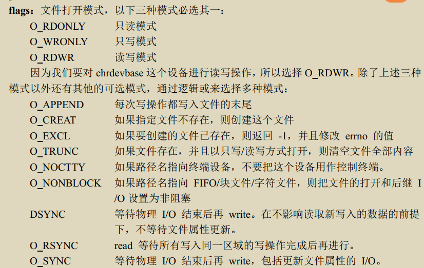

开发方式: 

1. 编译进内核
2. 编译为模块(.ko): 调试时常用, 使用 `insmod`/ `modprobe加载模块`


```
module_init(xxx_init) //注册加载函数    xxx_init就是要注册的函数
module_exit(xxx_exit) //注册卸载函数
```

有两种加载命令 `insmod`和 `modprobe`, `insmod`必须手动按顺序加载模块;  

`modprobe`可以自动分析依赖关系, 自动加载依赖文件


字符设备的注册与注销, 一般分别在 `xxx_init 和xxx_exit`中进行

以下的两个注册和注销函数是老版本的函数, 新版中使用内核推荐的新字符设备驱动API函数, 详见 **新字符设备驱动实验**


使用 `cat /proc/devices` 可以查看已经使用掉的设备号

实现设备具体操作函数后,需要添加LICENSE(许可证) 和作者信息

```c
MODULE_LICENSE("GPL"); //采用GPL协议
MODULE_AUTHOR("zuozhongkai");
```

#### 开发模板

需要其他功能自行添加即可

```c
/* 打开设备 */
2 static int chrtest_open(struct inode *inode, struct file *filp)
3 {
4 /* 用户实现具体功能 */
5 return 0;
6 }
7 
8 /* 从设备读取 */
9 static ssize_t chrtest_read(struct file *filp, char __user *buf, size_t cnt, loff_t *offt)
10 {
11 /* 用户实现具体功能 */
12 return 0;
13 }
14
15 /* 向设备写数据 */
16 static ssize_t chrtest_write(struct file *filp,const char __user *buf,size_t cnt, loff_t *offt)
17 {
18 /* 用户实现具体功能 */
19 return 0;
20 }
21
22 /* 关闭/释放设备 */
23 static int chrtest_release(struct inode *inode, struct file *filp)
24 {
25 /* 用户实现具体功能 */
26 return 0;
27 }
28
29 static struct file_operations test_fops = {
30 .owner = THIS_MODULE, 
31 .open = chrtest_open,
32 .read = chrtest_read,
33 .write = chrtest_write,
34 .release = chrtest_release,
35 };
36
37 /* 驱动入口函数 */
38 static int __init xxx_init(void)
39 {
40 /* 入口函数具体内容 */
41 int retvalue = 0;
42
43 /* 注册字符设备驱动 */
44 retvalue = register_chrdev(200, "chrtest", &test_fops);
45 if(retvalue < 0){
46 /* 字符设备注册失败,自行处理 */
47 }
48 return 0;
49 }
50
51 /* 驱动出口函数 */
52 static void __exit xxx_exit(void)
53 {
54 /* 注销字符设备驱动 */
55 unregister_chrdev(200, "chrtest");
56 }
57
58 /* 将上面两个函数指定为驱动的入口和出口函数 */
59 module_init(xxx_init);
60 module_exit(xxx_exit);
61 MODULE_LICENSE("GPL");
63 MODULE_AUTHOR("zuozhongkai");
```

#### 设备号

有主次之分, 主设备号是具体不同的驱动, 次设备号, 代表使用相同驱动的不同设备, 类型为 `dev_t`,(32位),  高12位为主设备号(0~4095), 低20位为次设备号

设备号的操作函数: `include/linux/kdev_t.h` 

```c
#define MINORBITS 20	//次设备号位数
#define MINORMASK ((1U << MINORBITS) - 1) 	//次设备号掩码, 实为低20位全为1
#define MAJOR(dev) ((unsigned int) ((dev) >> MINORBITS))	//取出主设备号
#define MINOR(dev) ((unsigned int) ((dev) & MINORMASK))		//取出次设备号
#define MKDEV(ma,mi) (((ma) << MINORBITS) | (mi))		//将主次设备号合并成为dev_t类型
```

##### 分配设备号

查看已使用设备号:

```shell
cat /proc/devices
```


1. 静态分配
   自定义未使用的设备号, 容易出现问题, 建议动态分配设备号

2. 动态分配设备号
   申请设备号函数

   ```c
   /*
   dev:保存申请到的设备号
   baseminor:次设备号起始地址, 因为该函数可以一次申请多个连续的设备号, 一般次设备号以baseminor = 0, 开始
   count: 要申请的设备号数量
   name: 设备名字
   */
   int alloc_chrdev_region(dev_t *dev, unsigned baseminor, unsigned count, const char *name)
   ```

   注销设备后需要释放设备号, 函数如下

   ```c
   /*
   from: 要释放的设备号
   count: 从from开始, 释放的设备号数量
   */
   void unregister_chrdev_region(dev_t from, unsigned count)
   ```

### chardevbase (虚拟)字符设备驱动实验

##### 驱动程序编写

添加Linux头文件路径, 打开 VSCode，按下“Crtl+Shift+P”打开 VSCode 的控制台，然后输入“C/C++: Edit configurations(JSON) ”，打开 C/C++编辑配置文件

```c
 /*
 分别是开发板所使用的 Linux 源码下的 include、arch/arm/include 和 arch/arm/include/generated 这三个目录的路径
 使用绝对路径
 */

"includePath": [
                "${workspaceFolder}/**",
                "/home/xy/linux/alientek_linux/linux-imx-4.1.15-2.1.0-e48931b1-v2.8/include",
    "/home/xy/linux/alientek_linux/linux-imx-4.1.15-2.1.0-e48931b1-v2.8/arch/arm/include",
"/home/xy/linux/alientek_linux/linux-imx-4.1.15-2.1.0-e48931b1-v2.8/arch/arm/include/generated/" 
            ],
```

按照驱动框架进行编写驱动

`printk`用于内核向控制台输出内容

可以对根据日志级别进行分类, 定义在`include/linux/kern_levels.h `

定义如下:

```c
#define KERN_SOH "\001"
#define KERN_EMERG KERN_SOH "0" /* 紧急事件，一般是内核崩溃
*/
#define KERN_ALERT KERN_SOH "1" /* 必须立即采取行动 */
#define KERN_CRIT KERN_SOH "2" /* 临界条件，比如严重的软件或硬件错误*/
#define KERN_ERR KERN_SOH "3" /* 错误状态，一般设备驱动程序中使用
KERN_ERR 报告硬件错误 */
#define KERN_WARNING KERN_SOH "4" /* 警告信息，不会对系统造成严重影响 */
#define KERN_NOTICE KERN_SOH "5" /* 有必要进行提示的一些信息 */
#define KERN_INFO KERN_SOH "6" /* 提示性的信息 */
#define KERN_DEBUG KERN_SOH "7" /* 调试信息
*/
```

消息的级别可以显式指定: 

```c
printk(KERN_EMERG "gsmi: Log Shutdown Reason\n");
```

不指定时,采用默认级别 `MESSAGE_LOGLEVEL_DEFAULT`  默认为 4. 

在 `include/linux/printk.h`中定义一个控制参数 `CONSOLE_LOGLEVEL_DEFAULT` 默认为 7 高于这个等级的消息才能显示.

##### 测试APP

编写过程中需要用到C语言与文件相关的库文件

```c
int open(const char *pathname, int flags)
    /*
O_RDONLY 只读模式
O_WRONLY 只写模式
O_RDWR 读写模式
    */
ssize_t read(int fd, void *buf, size_t count)
ssize_t write(int fd, const void *buf, size_t count);
int close(int fd);
```

**运行测试:**

- 加载驱动模块

​	需要在`/lib/modules/xxxx`下进行, xxx为开发板当前内核版本, 需要将 `.ko`文件和 `测试APP`一起	复制到这个文件夹,

​	如果使用`modprobe xxx.ko`进行加载, 可能出现找不到映射文件的情况, 这时使用`depmod` 即可	自动生成	`modules.alias``modules.symbols 和 modules.dep`

- 创建设备节点文件
  驱动加载成功后,需要在/dev下创建一个节点文件, 应用程序通过操作这个文件, 来完成对设备的操作

  ```shell
  # 创建节点命令, 节点文件位置信息, c: 字符设备, 主设备号, 次设备号
  mknod /dev/chrdevbase c 200 0
  ```

- 操作测试

​	`./chrdevbaseApp /dev/chrdevbase 1`, 采用这种命令模式进行测试

- 卸载驱动

​	`rmmod chrdevbse.ko`

### LED驱动开发

Linux下的外设驱动, 本质都是配置硬件寄存器,  LED通过IO口进行控制, 因此本章就是编写Linux下Imx6ull的GPIO引脚控制驱动

##### MMU

主要功能:

1. 虚拟空间到物理空间的映射
2. 内存保护, 可以设置访问权限,完成虚拟空间的缓冲特性

Linux启动后, 内存映射就会完成, 因此不能向物理地址直接写入数据, 

- 通过 `ioremap` 获取物理地址对应的虚拟地址, 其定义在 `arch/arm/include/asm/io.h`, 在设备初始化中

​	返回值为 `__iomem`类型的指针,使用以下代码即可获得虚拟地址:

```c
#define SW_MUX_GPIO1_IO03_BASE (0X020E0068)
static void __iomem* SW_MUX_GPIO1_IO03; // 分为3部分 static  void* __iomem：内核特殊修饰符
SW_MUX_GPIO1_IO03 = ioremap(SW_MUX_GPIO1_IO03_BASE, 4);
```

- 通过 `iounmap` 释放所做的映射, 在卸载驱动时需要进行

```c
	void iounmap (volatile void __iomem *addr)	//函数原型
    iounmap(SW_MUX_GPIO1_IO03);					//释放前文映射的虚拟地址
```

###### IO内存访问函数

这里的意思就是对刚才的虚拟内存进行访问的函数

1. 读函数

   ```c
   1 u8 readb(const volatile void __iomem *addr)
   2 u16 readw(const volatile void __iomem *addr)
   3 u32 readl(const volatile void __iomem *addr)
   //readb、readw 和 readl 这三个函数分别对应 8bit、16bit 和32bit
   ```

2. 写函数

   ```c
   1 void writeb(u8 value, volatile void __iomem *addr)
   2 void writew(u16 value, volatile void __iomem *addr)
   3 void writel(u32 value, volatile void __iomem *addr)
   // 对应数据长度与读函数一致
   ```

   

### 新字符设备驱动

##### 原理

1. 设备号的获取

   ```c
   //动态获取设备号
   int alloc_chrdev_region(dev_t *dev, unsigned baseminor, unsigned count, const char *name)
   ```

2. 注册与注销

   ```c
   //静态注册设备号
   int register_chrdev_region(dev_t from, unsigned count, const char *name)
   //注销
   void unregister_chrdev_region(dev_t from, unsigned count)
   ```

**字符设备的注册方法**
	**`cdev`结构体**, 表示字符设备, 定义在 `include/linux/cdev.h`

​	结构体如下

```c
	1 struct cdev {
	2 struct kobject kobj;
	3 struct module *owner;
	4 const struct file_operations *ops; // 操作函数集合
	5 struct list_head list;
	6 dev_t dev;						//设备号
	7 unsigned int count;
	8 };
```

​	**`cdev_init`**函数

```c
void cdev_init(struct cdev *cdev, const struct file_operations *fops)
```

​	**`cdev_add`**函数:  向Linux添加字符设备

```c
int cdev_add(struct cdev *p, dev_t dev, unsigned count)
```

​	以上函数加上分配设备号的函数就相当于`register_chrdev`的功能

​	**`cdev_del`**函数;   卸载驱动.        `cdev_del` 和 `unregister_chrdev_region` 这两个函数合起来的功能相当于 `unregister_chrdev` 函数。

```c
void cdev_del(struct cdev *p)
```

##### 自动创建设备节点

在驱动中实现自动创建设备节点

`mdev`机制(busybox中udev的简化版本),一个用户程序, 监视系统中硬件状态来管理设备文件

在`/etc/init.d/rcS`的以下语句

```shell
echo /sbin/mdev > /proc/sys/kernel/hotplug
```

1. **创建与删除类**
   自动创建是在, 驱动入口函数完成的,  一般位于 `cdev_add`后面.

   首先要**创建一个 class 类**，class 是个结构体，定义在文件 `include/linux/device.h` 里面。class_create 是类创建函数，class_create 是个宏定义

   ```c
   1 #define class_create(owner, name) \
   2 ({ \
   3 static struct lock_class_key __key; \
   4 __class_create(owner, name, &__key); \
   5 })
   6
   7 struct class *__class_create(struct module *owner, const char *name,
   8 												struct lock_class_key *key)
   ```

   使用如下

   ```c
   struct class *class_create (struct module *owner, const char *name)
       //owner 一般为THIS_MODULE, name是类的名字
   ```

   **删除类**

   ```c
   void class_destroy(struct class *cls);
   ```

2. **创建设备**
   按照上述操作创建过类之后,还要在类下创建一个设备, 使用 `device_create` 函数
   函数原型如下,

   ```c
   struct device *device_create(struct class *class, //类
   							struct device *parent, //父设备一般为NULL
   							dev_t devt, //设备号
   							void *drvdata, //可能会使用的一些数据,一般为NULL
   							const char *fmt, ...)//  设备名字
   ```

   是一个可变参数函数
   **卸载设备**

   ```c
   void device_destroy(struct class *class, dev_t devt)
   ```

3. **设置文件私有数据**

   将设备的属性组合成一个结构体, 在open函数中,将结构体赋给`struct file`中的`private_data`

### Linux设备树

DTS 文件采用树形结构描述板级设备，也就是开发板上的设备信息, 不同板子之间通用的信息存在文件 `.dtsi`文件(SOC级别的信息,SOC 有几个 CPU、主频是多少、各个外设控制器信息等)中, `.dts`(板级信息即外设信息)引用该文件即可

`DTB`文件是 `DTS`文件编译后的二进制文件, 采用 `DTC`工具进行编译, DTC 工具源码在 Linux 内核的 `scripts/dtc` 目录下，`scripts/dtc/Makefile`,  采用 `make dtbs`即可只编译设备树

##### 语法规则

- **`.dtsi`头文件**
  在设备树中, 可以通过`#include` 引用 `.h  .dtsi  .dts`文件, 该文件中将芯片所有的外设都描述的清清楚楚

- **设备节点**

  1. 每个设备树只有一个根节点 `/`
  2. 根节点下有着许多子节点, 子节点格式为: `node-name@unit-address` , `node-name`是节点名字, `unit-address` 是设备的地址或寄存器首地址,如果没有可以不要.  
     `cpu0:cpu@0`这里的`cpu0`是节点标签, 可以通过节点标签 `&cpu0`的方式访问`cpu@0`这个节点
  3. 节点都有不同的属性, 属性都是键值对
     设备树常用数据形式有以下几种:
     1. 字符串: `compatible = "arm,cortex-a7";`设置`compatible`属性的值为`arm, cortex-a7`
     2. 32位无符号整数: `reg = <0>;`  也可以是一组值: `reg = <0 0x123456 100>;`
     3. 字符串列表: `compatible = "fsl,imx6ull-gpmi-nand", "fsl, imx6ul-gpmi-nand";`

- **标准属性**
  节点由属性组成, 属性除了自定义的还有标准属性, 常用的标准属性有: 

  1.  `compatible`
        	兼容性属性, 值为字符串列表, 用于将驱动和设备绑定起来, 格式如下: `"manufacturer,model"`: 厂商＋驱动名.   一般驱动程序文件都会有一个 OF 匹配表(`of_device_id`结构体数组)，此 OF 匹配表保存着一些 compatible 值，如果设备节点的 compatible 属性值和 OF 匹配表中的任何一个值相等，那么就表示设备可以使用这个驱动。

  2. `model`
     也是一个字符串,描述设备模块信息, 名字等: `model = "wm8960-audio";`

  3. `status`
     字符串 , 描述状态信息, 它的值是可以选择的:

     1. `okay`: 代表设备可操作
     2. `disabled`: 代表设备不可操作, 但可以改变,比如热插拔设备
     3. `fail`:  代表设备不可操作, 因为检测到了错误
     4. `fail-sss`: 含义与`fail` 相同,`sss`代表错误内容

  4. `#address-cells`和 `#size-cells`

     ​	这两个属性的值都是无符号32位整数,可以用在任何拥有子节点的设备, 描述地址信息, `#address-cells`决定 `reg`属性中地址信息占用的字长, `#size-cells`决定长度信息所占**字长** 

  5. `reg`
     用于描述, 设备地址空间资源, 格式为(address，length)对: 
     `reg = <address1 length1 address2 length2 address3 length3……>`

  6. `ranges`

     ​	ranges 是一个地址映射/转换表

     ​	属性值可以为空或者 按照这个格式`child-bus-address,parent-bus-address,length`编写, 
     `child-bus-address` : 子总线地址物理地址，父节点的`#address-cells` 确定器所占用字长。

     `parent-bus-address`: 父总线地址物理地址，父节点的`#address-cells` 确定其占用的字长。

     `length`: 子地址空间的长度,由父节点的 `#size-cells`决定占用字长,子设备能在父总线上占用多大的地址范围. 如果为空值, 代表着父节点与子节点完全相同

  7. `device_type`

     `device_type` 属性值为字符串，IEEE 1275 会用到此属性，用于描述设备的 FCode，但是设备树没有 FCode，所以此属性也被抛弃了。此属性只能用于 cpu 节点或者 memory 节点。imx6ull.dtsi 的 cpu0 节点用到了此属性

- **根节点 `compatible`属性**

  ​	通过根节点的 compatible 属性可以知道我们所使用的设备，一般第一个值描述了所使用的硬件设备名字，比如这里使用的是“imx6ull-14x14-evk”这个设备，第二个值描述了设备所使用的 SOC，比如这里使用的是imx6ull”这颗 SOC。Linux内核通过 `compatible`属性查看是否支持设备.

  1. 使用设备树之前设备匹配方法
     	`uboot`向内核传递一个`machine id`(整数的宏定义)的值,用来描述设备型号.  针对每一个设备(板子)，Linux 内核都用 `MACHINE_START` 和` MACHINE_END` (有点像,ifdef和endif)来定义一个` machine_desc` 结构体来描述这个设备, 定义在`arch/arm/mach-imx/mach-mx35_3ds.c`中, 设备id定义在`include/generated/mach-types.h`中

  2. 使用设备树后的匹配方式
     采用`DT_MACHINE_START` 和 `DT_MACHINE_END`, 定义位置和上文一致, 不适用`machine id`进行匹配. 

     

     调用过程: 

     ​	内核调用,`start_kernel`启动内核,该函数会调用`setup_arch`来匹配`machine_desc` , 该函数定义在`arch/arm/kernel/setup.c`
     

- **向节点追加或修改内容**

  追加最简单的方法是在`imx6ull.dts`头文件直接添加子节点. 
  

  但是这样会影响所有使用这个imx6ull芯片的板子, 因此我们需要在设备树文件`imx6ull-alientek-emmc.dts`中进行追加,我们可以通过`&label`访问节点,从而对节点进行追加内容

  

##### 创建设备树模板

​	


##### 设备树在系统中的体现 

​	系统启动时,会解析设备树, 在`/proc/device-tree`下创建文件夹,逐层嵌套

- 特殊节点

  在根节点“/”中有两个特殊的子节点：`aliases` 和 `chosen`,

  1. `aliases`是别名节点, 主要作用就是定义节点的别名,

     ```c
     18 aliases {
     19 can0 = &flexcan1;		//通过&label直接访问节点
     20 can1 = &flexcan2;
     21 ethernet0 = &fec1;
     22 ethernet1 = &fec2;
     23 gpio0 = &gpio1;
     24 gpio1 = &gpio2;
     ......
     42 spi0 = &ecspi1;
     43 spi1 = &ecspi2;
     44 spi2 = &ecspi3;
     45 spi3 = &ecspi4;
     46 usbphy0 = &usbphy1;
     47 usbphy1 = &usbphy2;
     }
     ```

  2. `chosen`子节点, 是为了`uboot`向`Linux`内核传递数据,一般`.dts`中的`chosen`节点通常为空,或者内容很少

     比如只定义了标准输出:

     ```c
     18 chosen {
     19 stdout-path = &uart1;
     20 };
     ```

     实际启动后还会多出: `bootargs`和`name`两个变量, `bootargs`是uboot传递给Linux的(通过`fdt_chosen`函数)

##### 内核解析DTB文件

​	内核启动时调用`start_kernel`函数, 在这个函数中解析DTB文件, 最终工作的函数是`flatten_dt_node()`函数

##### 绑定信息文档

​	Linux内核中有`.txt`文档, 描述了如何添加节点, 这些文档叫做绑定文档,位于`/Documentation/devicetree/bindings`

##### 设备树常用OF函数

​	OF函数 是获取设备树中信息的函数, 有着统一的前缀`of_`

1. 查找节点
   Linux使用`device_node`结构体描述节点,位于`include/linux/of.h`,  查找函数共有五个,区别在于通过什么属性查找:

   - 通过名字:

     **from**：开始查找的节点，如果为 NULL 表示从根节点开始查找整个设备树。

     **name**：要查找的节点名字。

     **返回值：**找到的节点，如果为 NULL 表示查找失败。

     ```c
     struct device_node *of_find_node_by_name(struct device_node *from,const char 																	*name);
     ```

   - 通过`device_type`属性

     **from**：开始查找的节点，如果为 NULL 表示从根节点开始查找整个设备树。

     **type**：要查找的节点对应的 type 字符串，也就是 device_type 属性值。

     **返回值：**找到的节点，如果为 NULL 表示查找失败。

     ```c
     struct device_node *of_find_node_by_type(struct device_node *from, const char 																		*type);
     ```

   - 通过`compatible`和`device_type`属性

     **from**：开始查找的节点，如果为 NULL 表示从根节点开始查找整个设备树。

     **type**：要查找的节点对应的 type 字符串，也就是 device_type 属性值，可以为 NULL，表示忽略掉 device_type 属性。

     **compatible**要查找的节点所对应的 compatible 属性列表。

     **返回值：**找到的节点，如果为 NULL 表示查找失败

     ```c
     struct device_node *of_find_compatible_node(struct device_node *from,
     										const char *type, const char *compatible)
     ```

   - 通过`of_device_id`匹配表

     **from**：开始查找的节点，如果为 NULL 表示从根节点开始查找整个设备树。

     **matches**：of_device_id 匹配表，也就是在此匹配表里面查找节点。

     **match**：找到的匹配的 of_device_id。

     **返回值：**找到的节点，如果为 NULL 表示查找失败

     ```c
     struct device_node *of_find_matching_node_and_match(struct device_node *from,
      			const struct of_device_id *matches,const struct of_device_id **match)
     ```

   - 通过路径

     **path**：带有全路径的节点名，可以使用节点的别名，比如“/backlight”就是 backlight 这个节点的全路径。

     **返回值：**找到的节点，如果为 NULL 表示查找失败

     ```c
     inline struct device_node *of_find_node_by_path(const char *path)
     ```

2. 查找父/子节点

   - 获得父节点

     **node**：要查找的父节点的节点。

     **返回值：**找到的父节点。

     ```c
     struct device_node *of_get_parent(const struct device_node *node)
     ```

   - 获得子节点

     迭代方式获取

     **node**：父节点。

     **prev**：前一个子节点，也就是从哪一个子节点开始迭代的查找下一个子节点。可以设置为NULL，表示从第一个子节点开始。

     **返回值：**找到的下一个子节点。

     ```c
     struct device_node *of_get_next_child(const struct device_node *node,
      														struct device_node *prev)
     ```

3. 获得属性值

   Linux采用结构体`property`表示属性, 也定义在`include/linux/of.h`

   

   - 查找 指定属性

     **np**：设备节点。

     **name**： 属性名字。

     **lenp**：属性值的字节数

     **返回值：**找到的属性。

     ```c
     property *of_find_property(const struct device_node *np,const char*name,int* lenp)
     ```

   - 获取属性中元素数量

     **np**：设备节点。

     **proname**： 需要统计元素数量的属性名字。

     **elem_size**：元素长度。

     **返回值：**得到的属性元素数量。

     ```c
     int of_property_count_elems_of_size(const struct device_node *np,const char 															*propname, int elem_size)
     ```

   - 获取属性中指定的u32类型数据

     **np**：设备节点。

     **proname**： 要读取的属性名字。

     **index**：要读取的值标号。

     **out_value**：读取到的值

     **返回值：**0 读取成功，负值，读取失败，-EINVAL 表示属性不存在，-ENODATA 表示没有要读取的数据，-EOVERFLOW 表示属性值列表太小。

     ```c
     int of_property_read_u32_index(const struct device_node *np,const char 														*propname,u32 index, u32 *out_value)
     ```

   - 读取属性中的数组数据

     **np**：设备节点。

     **proname**： 要读取的属性名字。

     **out_value**：读取到的数组值，分别为 u8、u16、u32 和 u64。

     **sz**：要读取的数组元素数量。

     **返回值：**0，读取成功，负值，读取失败，-EINVAL 表示属性不存在，-ENODATA 表示没有要读取的数据，-EOVERFLOW 表示属性值列表太小。

     ```c
     int of_property_read_u8_array(const struct device_node *np,
                                                                 const char *propname, 
                                                                 u8 *out_values, 
                                                                 size_t sz)
     int of_property_read_u16_array(const struct device_node *np,
                                                                      
     int of_property_read_u32_array(const struct device_node *np,
                                                                  const char *propname, 
                                                                  u32 *out_values,
                                                                  size_t sz)
     int of_property_read_u64_array(const struct device_node *np,
                                                              const char *propname, 
                                                              u64 *out_values,
                                                              size_t sz)
     ```

   - 获取整型属性,数据

     有些属性只有一个整形值，这四个函数就是用于读取这种只有一个整形值的属性，分别用于读取 u8、u16、u32 和 u64 类型属性值

     **np**：设备节点。

     **proname**： 要读取的属性名字。

     **out_value**：读取到的数值。

     **返回值：**0，读取成功，负值，读取失败，-EINVAL 表示属性不存在，-ENODATA 表示没有要读取的数据，-EOVERFLOW 表示属性值列表太小。

     ```c
     int of_property_read_u8(const struct device_node *np, 
                                                                 const char *propname,
                                                                 u8 *out_value)
     int of_property_read_u16(const struct device_node *np, 
                                                                 const char *propname,
                                                                 u16 *out_value)
     int of_property_read_u32(const struct device_node *np, 
                                                                 const char *propname,
                                                                 u32 *out_value)
     int of_property_read_u64(const struct device_node *np, 
                                                                 const char *propname,
                                                                 u64 *out_value)
     ```

   - 获取属性字符串值

     **np**：设备节点。

     **proname**： 要读取的属性名字。

     **out_string**：读取到的字符串值。

     **返回值：**0，读取成功，负值，读取失败。

     ```c
     int of_property_read_string(struct device_node *np, const char *propname,const 																	char **out_string)
     ```

   - 获取`#address-cells`值

     ```c
     int of_n_addr_cells(struct device_node *np)
     ```

   - 获取`#size-cells`值

     ```c
     int of_n_size_cells(struct device_node *np)
     ```

   ##### 其余常用OF函数

1. 检查设备兼容性,即比较`compatible`属性

   **device**：设备节点。

   **compat**：要查看的字符串。

   **返回值：**0，节点的 compatible 属性中不包含 compat 指定的字符串；正数，节点的 compatible 属性中包含 compat 指定的字符串。

   ```c
   int of_device_is_compatible(const struct device_node *device, const char *compat)
   ```

2. 获取地址相关属性

   获取`reg`或者`assigned-address`属性值

   **dev**：设备节点。

   **index**：要读取的地址标号。

   **size**：地址长度。

   **flags**：参数，比如 IORESOURCE_IO、IORESOURCE_MEM (IO端口/IO内存)等

   **返回值：**读取到的地址数据首地址，为 NULL 的话表示读取失败。

   ```c
   const __be32 *of_get_address(struct device_node *dev, int index, u64 *size,unsigned 																		int *flags)
   ```

3. 地址转换,将设备树地址,转换为物理地址

   **dev**：设备节点。

   **in_addr**：要转换的地址。

   **返回值：**得到的物理地址，如果为 OF_BAD_ADDR 的话表示转换失败。

   ```c
   u64 of_translate_address(struct device_node *dev, const __be32 *in_addr)
   ```

4. 将`reg`属性转换为`resource`结构体类型

   `resource`结构体用来描述设备资源信息, 定义在`include/linux/ioport.h`

   ```c
   18 struct resource {
   19 resource_size_t start;		//u32类型
   20 resource_size_t end;			
   21 const char *name;			//资源的名字
   22 unsigned long flags;		//资源类型,定义在`include/linux/ioport.h`中
   23 struct resource *parent, *sibling, *child;
   24 };
   ```

   **dev**：设备节点。

   **index**：地址资源标号。

   **r**：得到的 resource 类型的资源值。

   **返回值：**0，成功；负值，失败。

   ```c
   int of_address_to_resource(struct device_node *dev, int index,struct resource *r)
   ```

5. 设备树物理地址映射: 将`reg`属性地址信息转换了虚拟地址

   **np**：设备节点。

   **index**：reg 属性中要完成内存映射的段，如果 reg 属性只有一段的话 index 就设置为 0。

   **返回值：**经过内存映射后的虚拟内存首地址，如果为 NULL 的话表示内存映射失败。

   ```c
   void __iomem *of_iomap(struct device_node *np, int index)
   ```

   

### 设备树下的LED驱动实验

重点内容如下:

​	①、在 imx6ull-alientek-emmc.dts 文件中创建相应的设备节点。

​	②、编写驱动程序(在第新字符设备驱动基础上完成)，获取设备树中的相关属性值。

​	③、**使用获取到的有关属性值来初始化 LED 所使用的 GPIO。**

```
①、修改设备树，添加相应的节点，节点里面重点是设置 reg 属性，reg 属性包括了 GPIO相关寄存器。
②、获取 reg 属性中 IOMUXC_SW_MUX_CTL_PAD_GPIO1_IO03 和 IOMUXC_SW_PAD_
CTL_PAD_GPIO1_IO03 这两个寄存器地址，并且初始化这两个寄存器，这两个寄存器用于设置
GPIO1_IO03 这个 PIN 的复用功能、上下拉、速度等。
③、在②里面将 GPIO1_IO03 这个 PIN 复用为了 GPIO 功能，因此需要设置 GPIO1_IO03
这个 GPIO 相关的寄存器，也就是 GPIO1_DR 和 GPIO1_GDIR 这两个寄存器。
```


### pinctrl和gpio子系统

​	该子系统用于GPIO驱动,简化GPIO驱动开发,以前的基于设备树的驱动开发,本质与裸机相同,都是操作GPIO寄存器, `pinctrl`子系统添加引脚配置, `gpio`子系统初始化gpio并提供api函数

#### pinctrl子系统

手动设置引脚功能容易出问题,子系统作用如下:

①、获取设备树中 pin 信息。
②、根据获取到的 pin 信息来设置 pin 的复用功能
③、根据获取到的 pin 信息来设置 pin 的电气特性，比如上/下拉、速度、驱动能力等。

因此对于我们来说,只需要在设备树中设置好引脚的相关属性即可, pinctrl子系统源码位于`drivers/pinctrl`

`iomuxc`节点就是外设对应的节点,在设备树中,添加子节点,子节点的相关属性,引脚功能配置情况


#### gpio子系统

imx6ull的GPIO驱动文件位于`drivers/gpio/gpio-mxc.c`, `gpiolib`开始的文件是gpio驱动的核心文件，位于`drivers/gpio/`

###### api函数

1. 申请引脚
   使用之前一定要申请

   **gpio**：要申请的 gpio 标号，使用 `of_get_named_gpio` 函数从设备树获取指定 GPIO 属性信 息，此函数会返回这个GPIO的标号。

   label：给 gpio 设置个名字。

     返回值：0，申请成功；其他值，申请失败。 

   ```
   int gpio_request(unsigned gpio,  const char *label) 
   ```

2. 释放引脚

   gpio：要释放的gpio标号。

   ```
   void gpio_free(unsigned gpio) 
   ```

3. 设置输入模式

   int gpio_direction_input(unsigned gpio) 

   ```
   int gpio_direction_input(unsigned gpio) 
   ```

4. 设置输出模式

   gpio：要设置为输出的GPIO标号。 

    value：GPIO 默认输出值。 

    返回值：0，设置成功；负值，设置失败。

   ```
   int gpio_direction_output(unsigned gpio, int value)
   ```

5. 获取引脚数值

   宏定义的函数

   gpio：要获取的GPIO标号。  

   返回值：非负值，得到的GPIO值；负值，获取失败。

   ```
   #define gpio_get_value  __gpio_get_value 
   int __gpio_get_value(unsigned gpio)
   ```

6. 设置引脚数值

   gpio：要设置的GPIO标号。  

   value：要设置的值。  

   返回值：无 

   ```
   #define gpio_set_value  __gpio_set_value 
   void __gpio_set_value(unsigned gpio, int value) 
   ```

###### 向设备树中添加gpio节点

1. 创建子节点,
2. 添加pinctrl信息
3. 添加GPIO属性信息

###### 与gpio相关的OF函数

1. 统计设备树某个属性定义了几个GPIO信息,空的GPIO也会被统计

   np：设备节点。  

   propname：要统计的GPIO属性。  

   返回值：正值，统计到的GPIO数量；负值，失败。 

   ```
   int of_gpio_named_count(struct device_node *np, const char  *propname) 
   ```

2. 统计的是“gpios”这个属性的GPIO数量

   np：设备节点。  

   返回值：正值，统计到的GPIO数量；负值，失败。

   ```
   int of_gpio_count(struct device_node *np)
   ```

3. 获取GPIO编号

   np：设备节点。  

   propname：包含要获取GPIO信息的属性名。

   index：GPIO 索引，因为一个属性里面可能包含多个GPIO，此参数指定要获取哪个GPIO 的编号，如果只有一个GPIO信息的话此参数为0。  

   返回值：正值，获取到的GPIO编号；负值，失败。

   ```c
   int of_get_named_gpio(struct device_node  *np, const char *propname, int index) 
   ```

   

#### 修改设备树文件过程

1. 添加`pinctrl`节点

   在`iomuxc`(IO配置)节点下

   ```c
    pinctrl_led: ledgrp { 
   fsl,pins = <   
   MX6UL_PAD_GPIO1_IO03__GPIO1_IO03   0x10B0 /* LED0 */      
   >;
    };
   ```

2. 添加LED设备节点

   在根节点`/`下添加设备的节点

   ```c
   gpioled { 
   #address-cells = <1>; 
   #size-cells = <1>; 
   compatible = "atkalpha-gpioled"; 
   pinctrl-names = "default"; 
   pinctrl-0 = <&pinctrl_led>; 
   led-gpio = <&gpio1 3 GPIO_ACTIVE_LOW>; 
   status = "okay"; 
    }; 
   ```

3. 检查引脚是否被其他外设使用!!!!!

   这一点非常重要分为以下两个部分

   ①、检查pinctrl设置。 

   

    ②、如果这个PIN配置为GPIO的话，检查这个GPIO有没有被别的外设使用。

   

#### 驱动程序编写

 [05_gpioled](F:\BaiduNetdiskDownload\01、例程源码\

### 蜂鸣器实验

参照子系统修改代码


### Linux并发与竞争

#### 并发与竞争

**产生原因**

1. 多线程并发访问(根本原因)
2. 抢占式并发访问
3. 中断程序并发访问
4. SMP(多核)核间并发访问

#### 原子操作

- 原子整形操作API(针对整型变量)

  `atomic_t` 的结构体, 此结构体定义在include/linux/types.h

  ```
  typedef struct {
   int counter;
   } atomic_t;
  ```

  使用API之前需要定义`atomic_t`变量,以下为32位操作,64位SOC将`atomic`换为`atomic64`即可

  ```c
  ATOMIC_INIT(int i)		 				定义原子变量的时候对其初始化。
  int atomic_read(atomic_t *v) 			读取 v 的值，并且返回。
  void atomic_set(atomic_t *v, int i)		向 v 写入 i 值。
  void atomic_add(int i, atomic_t *v) 	给 v 加上 i 值。
  void atomic_sub(int i, atomic_t *v)		从 v 减去 i 值。
  void atomic_inc(atomic_t *v)		 	给 v 加 1，也就是自增。
  void atomic_dec(atomic_t *v) 			从 v 减 1，也就是自减
  int atomic_dec_return(atomic_t *v) 		从 v 减 1，并且返回 v 的值。
  int atomic_inc_return(atomic_t *v)		给 v 加 1，并且返回 v 的值。
  int atomic_sub_and_test(int i, atomic_t *v)		从 v 减 i，如果结果为 0 就返回真，否则返回假
  int atomic_dec_and_test(atomic_t *v) 			从 v 减 1，如果结果为 0 就返回真，否则返回假
  int atomic_inc_and_test(atomic_t *v)			给 v 加 1，如果结果为 0 就返回真，否则返回假
  int atomic_add_negative(int i, atomic_t *v)		给 v 加 i，如果结果为负就返回真，否则返回假
  ```

- 原子位操作

  没有结构体,直接对内存地址进行操作

  ```c
  void set_bit(int nr, void *p) 					将 p 地址的第 nr 位置 1。
  void clear_bit(int nr,void *p) 					将 p 地址的第 nr 位清零。
  void change_bit(int nr, void *p) 				将 p 地址的第 nr 位进行翻转。
  int test_bit(int nr, void *p) 					获取 p 地址的第 nr 位的值。
  int test_and_set_bit(int nr, void *p) 	   将 p 地址的第 nr 位置 1，并且返回 nr 位原来的值。
  int test_and_clear_bit(int nr, void *p)    将 p 地址的第 nr 位清零，并且返回 nr 位原来的值。
  int test_and_change_bit(int nr, void *p)   将 p 地址的第 nr 位翻转，并且返回 nr 位原来的值。
  ```

#### 自旋锁(注意死锁)

​	用于线程与线程之间: 适用于SMP(多核)核间访问,或单核下的线程并发访问, 持有自旋锁的线程不能够调用 能够引起休眠和阻塞的API否则会产生以下事件:

​	如果线程 A 在持有锁期间进入了休眠状态，那么线程 A 会自动放弃 CPU 使用权。线程 B 开始运行，线程 B 也想要获取锁，但是此时锁被 A 线程持有，而且内核抢占还被禁止了！线程 B 无法被调度出去，那么线程 A 就无法运行，锁也就无法释放，好了，死锁发生了！

​	当锁被其他线程持有时, 其他进程需要时,一直在原地等待锁可用,不会休眠或者进行其他操作,因此自旋锁的被持有时间不能太长,自旋锁适用于短时期的轻量级加锁.`Linux`内核用` spinlock_t`结构体, 使用之前需要定义一个`spinlock_t` 变量

- 自旋锁的API函数

  ```c
  DEFINE_SPINLOCK(spinlock_t lock) 				定义并初始化一个自选变量。
  int spin_lock_init(spinlock_t *lock) 		初始化自旋锁。
  void spin_lock(spinlock_t *lock) 		获取指定的自旋锁，也叫做加锁。
  void spin_unlock(spinlock_t *lock) 			释放指定的自旋锁。
  int spin_trylock(spinlock_t *lock) 				尝试获取指定的自旋锁，如果没有获取到就返回 0
  int spin_is_locked(spinlock_t *lock)
  							检查指定的自旋锁是否被获取，如果没有被获取就返回非 0，否则返回 0。
  ```

​	如果线程运行时,中断也需要获取自旋锁, 此时应该避免,**本地中断**,即在同一个核心下进行中断, 解决此问题,就是在获取自旋锁之前,关闭本地中断,依靠以下函数:

**本地中断,自旋锁相关API**

```c
void spin_lock_irq(spinlock_t *lock) 禁止本地中断，并获取自旋锁。
void spin_unlock_irq(spinlock_t *lock) 激活本地中断，并释放自旋锁。  
							//以上两个不建议使用, 因为需要保证当前不处于中断状态,建议使用以下两个函数
void spin_lock_irqsave(spinlock_t *lock, unsigned long flags)					
											保存中断状态，禁止本地中断，并获取自旋锁。
void spin_unlock_irqrestore(spinlock_t *lock, unsigned long flags)															将中断状态恢复到以前的状态，并且激活本地中断，释放自旋锁。
    							//	flags用来存储中断使能状态,这里传入变量名,在底层实现中利用汇										编语言,将使能状态赋值给flags变量
/*中断下半部相关函数, 中断下半部也会竞争资源*/   ->//中断设计分为上半部和下半部,上半部是快速响应部分,下ban'bu是一些耗时和不要求实时性的操作
void spin_lock_bh(spinlock_t *lock) 关闭下半部，并获取自旋锁。
void spin_unlock_bh(spinlock_t *lock) 打开下半部，并释放自旋锁。
```

**其他类型的锁**

- 读写自旋锁(使用需满足读/写模型或生产者/消费者模型)

  ​	读写自旋锁为读和写操作提供了不同的锁，一次只能允许一个写操作，也就是只能一个线程持有写锁，而且不能进行读操作。但是当没有写操作的时候允许一个或多个线程持有读锁，可以进行并发的读操作。Linux 内核使用 `rwlock_t` 结构体表示读写锁

```c
DEFINE_RWLOCK(rwlock_t lock) 定义并初始化读写锁
void rwlock_init(rwlock_t *lock) 初始化读写锁。
//读锁
void read_lock(rwlock_t *lock) 获取读锁。
void read_unlock(rwlock_t *lock) 释放读锁。
void read_lock_irq(rwlock_t *lock) 禁止本地中断，并且获取读锁。
void read_unlock_irq(rwlock_t *lock) 打开本地中断，并且释放读锁。
void read_lock_irqsave(rwlock_t *lock,unsigned long flags) 
											保存中断状态，禁止本地中断，并获取读锁。
void read_unlock_irqrestore(rwlock_t *lock,unsigned long flags)
										将中断状态恢复到以前的状态，并且激活本地中断，释放读锁。
void read_lock_bh(rwlock_t *lock) 关闭下半部，并获取读锁。
void read_unlock_bh(rwlock_t *lock) 打开下半部，并释放读锁。
//写锁
void write_lock(rwlock_t *lock) 获取写锁。
void write_unlock(rwlock_t *lock) 释放写锁。
void write_lock_irq(rwlock_t *lock) 禁止本地中断，并且获取写锁。
void write_unlock_irq(rwlock_t *lock) 打开本地中断，并且释放写锁。
void write_lock_irqsave(rwlock_t *lock,unsigned long flags) 
    											保存中断状态，禁止本地中断，并获取写锁。
void write_unlock_irqrestore(rwlock_t *lock,unsigned long flags)
										将中断状态恢复到以前的状态，并且激活本地中断，释放写锁。
//下半部相关
void write_lock_bh(rwlock_t *lock) 关闭下半部，并获取读锁。
void write_unlock_bh(rwlock_t *lock) 打开下半部，并释放读锁。
```

- 顺序锁(针对读多写少)

  ​	顺序锁,演变于读写锁,支持读写同时进行,最好同时进行时,重新进行读取. 

  ​	顺序锁保护对象不能够是指针,可能出现野指针的问题

  ​	`seqlock_t` 结构体表示顺序锁

  ```c
  DEFINE_SEQLOCK(seqlock_t sl) 定义并初始化顺序锁
  void seqlock_ini seqlock_t *sl) 初始化顺序锁。
  //顺序锁写操作
  void write_seqlock(seqlock_t *sl) 获取写顺序锁。
  void write_sequnlock(seqlock_t *sl) 释放写顺序锁。
  void write_seqlock_irq(seqlock_t *sl) 禁止本地中断，并且获取写顺序锁
  void write_sequnlock_irq(seqlock_t *sl) 打开本地中断，并且释放写顺序锁。
  void write_seqlock_irqsave(seqlock_t *sl, unsigned long flags)
  								保存中断状态，禁止本地中断，并获取写顺序锁。
  void write_sequnlock_irqrestore(seqlock_t *sl,unsigned long flags)
  					将中断状态恢复到以前的状态，并且激活本地中断，释放写顺序锁。
  void write_seqlock_bh(seqlock_t *sl) 关闭下半部，并获取写读锁。
  void write_sequnlock_bh(seqlock_t *sl) 打开下半部，并释放写读锁。
  //顺序锁读操作
  unsigned read_seqbegin(const seqlock_t *sl)
  				读单元访问共享资源的时候调用此函数，此函数会返回顺序锁的顺序号。
  unsigned read_seqretry(const seqlock_t *sl,unsigned start)  
      				//start: 开始读取时的顺序锁的序列号
   				读结束以后调用此函数检查在读的过程中有没有对资源进行写操作，如果有的话就要重读
  ```

###### 自旋锁使用注意事项

1. 锁的持有时间要短, 长时间的话, 使用信号量和互斥体
2. 临界区内不能调用导致线程休眠的函数, 会导致死锁
3. 不能递归申请自旋锁, 会导致死锁: 自己把自己锁死了
4. 为了代码的通用性, 在申请自旋锁时, 关闭本地中断, 该行为不仅会关闭本核心的中断,还会使其他核心需要获取自旋锁时,原地自旋等待,不会发生死锁

#### 信号量

特点:

1. 可以使等待资源的线程休眠, 适合资源长时间占用的场合
2. 资源短时间占用情况下, 信号量开销大,因为会引起线程切换
3. 不能用在中断中使用,因为会引起休眠

`Linux`使用`semaphore`结构体表示信号量

信号量相关API

```c
DEFINE_SEAMPHORE(name) 定义一个信号量，并且设置信号量的值为 1。
void sema_init(struct semaphore *sem, int val)		初始化信号量 sem，设置信号量值为 val。
void down(struct semaphore *sem)		获取信号量，因为会导致休眠，因此不能在中断中使用。
int down_trylock(struct semaphore *sem);		
			尝试获取信号量，如果能获取到信号量就获取，并且返回 0.如果不能就返回非 0，并且不会进入休眠。
int down_interruptible(struct semaphore *sem)
			获取信号量，和 down 类似，只是使用 down 进入休眠状态的线程不能被信号打断。而使用此函数进入				休眠以后是可以被信号打断的。
void up(struct semaphore *sem) 			释放信号量
```

#### 互斥体

Linux中使用`mutex`结构体,表示互斥体, 实现互斥访问

请注意:

1. mutex可以导致休眠,不能在中断中使用, 中断中只能使用自旋锁
2. 可以调用引起阻塞的API
3. 解锁只能由持有者进行. 不能进行递归上锁和解锁

互斥体的API

```c
DEFINE_MUTEX(name) 定义并初始化一个 mutex 变量。
void mutex_init(mutex *lock) 初始化 mutex。
void mutex_lock(struct mutex *lock)		获取 mutex，也就是给 mutex 上锁。如果获取不到就进休眠。
void mutex_unlock(struct mutex *lock) 释放 mutex，也就给 mutex 解锁。
int mutex_trylock(struct mutex *lock)		尝试获取 mutex，如果成功就返回 1，如果失败就返回 0。
int mutex_is_locked(struct mutex *lock)	   判断 mutex 是否被获取，如果是的话就返回1，否则返回 0。
int mutex_lock_interruptible(struct mutex *lock)
										使用此函数获取信号量失败进入休眠以后可以被信号打断。
```


### Linux内核定时器

系统节拍数溢出被称为绕回, 需要以下api进行处理

jiffies: 系统启动后的系统节拍数

```c
time_after(unkown, known)
									//unkown 通常为 jiffies，known 通常是需要对比的值。 
time_before(unkown, known)
time_after_eq(unkown, known)
time_before_eq(unkown, known)
```

jiffies和秒的转换函数

```c
//将 jiffies 类型的参数 j 分别转换为对应的毫秒、微秒、纳秒。
int jiffies_to_msecs(const unsigned long j) 		 
int jiffies_to_usecs(const unsigned long j)
u64 jiffies_to_nsecs(const unsigned long j)
// 将毫秒、微秒、纳秒转换为 jiffies 类型。
long msecs_to_jiffies(const unsigned int m) 
long usecs_to_jiffies(const unsigned int u)
unsigned long nsecs_to_jiffies(u64 n)
```

Linux 内核使用 `timer_list` 结构体表示内核定时器，`timer_list` 定义在文件`include/linux/timer.h` 中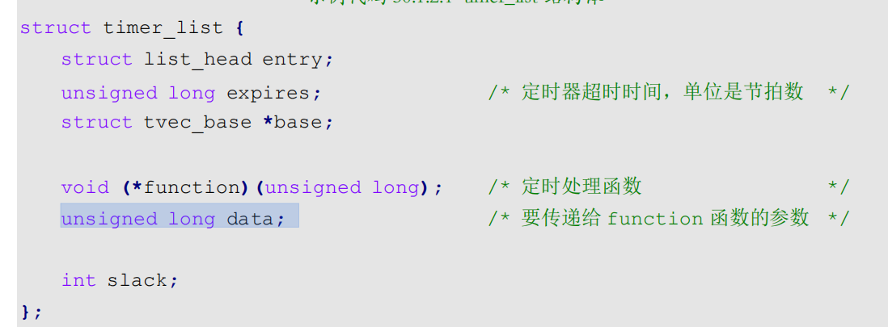

使用之前需要初始化,相关API:

1. **timer**：要初始化定时器。使用之前一定要初始化

   ```c
   void init_timer(struct timer_list *timer)
   ```

2. **add_timer** **函数**

   add_timer 函数用于向 Linux 内核注册定时器，使用 add_timer 函数向内核注册定时器以后，定时器就会开始运行，  

   ```c
   void add_timer(struct timer_list *timer)
   ```

3. **del_timer** **函数**

   **timer**：要删除的定时器。

   **返回值：**0，定时器还没被激活；1，定时器已经激活。

   ```c
   int del_timer(struct timer_list * timer)
   ```

4. **del_timer_sync** **函数**

   等待使用完毕后,在删除,不能在中断中使用

   **timer**：要删除的定时器。

   **返回值：**0，定时器还没被激活；1，定时器已经激活。

   ```c
   int del_timer_sync(struct timer_list *timer)
   ```

5. **mod_timer** **函数**

   修改定时值

   **timer**：要修改超时时间(定时值)的定时器。

   **expires**：修改后的超时时间,单位是节拍数。

   **返回值：**0，调用 mod_timer 函数前定时器未被激活；1，调用 mod_timer 函数前定时器已被激活

   ```c
   int mod_timer(struct timer_list *timer, unsigned long expires)
   ```

   **内核短延时函数**

   ```c
   //ns/us/msyan'shi
   void ndelay(unsigned long nsces)
   void udelay(unsigned long usecs)
   void mdelay(unsigned long msecs)
   ```

   

### Linux中断

与中断相关的API

1. 中断号,每一个中断都有, int变量表示	

2. `request_irq`函数:可能会引起睡眠

   irq：要申请中断的中断号。

   handler：中断处理函数，当中断发生以后就会执行此中断处理函数。

   flags：中断标志，可以在文件include/linux/interrupt.h 里面查看所有的中断标志

   name：中断名字，设置以后可以在/proc/interrupts 

   文件中看到对应的中断名字。

   dev： 如果将 flags 设置为 IRQF_SHARED 的话， dev 

   用来区分不同的中断，一般情况下将dev 设置为设备结构体， dev 会传递给中断处理函数 irq_handler_t 

   的第二个参数。

   返回值： 0 中断申请成功，其他负值 中断申请失败，如果返回-EBUSY 的话表示中断已经被申请了。

   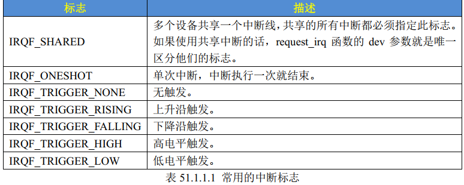

   ```c
   int request_irq  (unsigned int irq,irq_handler_t handler,unsigned long flags,
   						const char *name,void *dev)
   ```

3. `free_irq`函数:释放中断

   irq： 要释放的中断。

   dev：如果中断设置为共享(IRQF_SHARED)的话，此参数用来区分具体的中断。共享中断只有在释放最后中断处理函数的时候才会被禁止掉。

   返回值：无。

   ```c
   void free_irq(unsigned int irq,void *dev)
   ```

4. 中断处理函数

   格式如下

   ```c
   irqreturn_t (*irq_handler_t) (int, void *)
   ```

   `irqreturn_t`结构

   ```c
   enum irqreturn {
   IRQ_NONE = (0 << 0),
   IRQ_HANDLED = (1 << 0),
   IRQ_WAKE_THREAD = (1 << 1),
   };
   typedef enum irqreturn irqreturn_t;
   ```

   中断返回值使用如下:

   ```c
   return IRQ_RETVAL(IRQ_HANDLED)
   ```

5. 中断使能和禁止函数

   常用:

   ```c
   void enable_irq(unsigned int irq)
   void disable_irq(unsigned int irq) //会等待当前中断处理函数执行完才返回, 可以使用另一个
   void disable_irq_nosync(unsigned int irq) //不会等待当前中断处理程序执行完毕
   local_irq_enable() 	//使能中断系统
   local_irq_disable()	//禁止中断系统   以上两个函数,不同任务之间可能会互相影响
   local_irq_save(flags)	//禁止中断,并且将中断状态保存在 flags 中
   local_irq_restore(flags)	//恢复中断,将中断到 flags 状态
   ```

   

#### 中断上下部

**上半部**

对时间敏感的部分,操作硬件的部分,不希望被其他中断打断

##### **下半部**

下半部机制

软中断和`tasklet`都在中断上下文中执行

工作队列在进程上下文中执行, 执行的比软中断和`tasklet`的快

###### 软中断

使用`softirq_action`结构体表示软中断

```c
struct softirq_action
{
void (*action)(struct softirq_action *);
}
```

,在 `kernel/softirq.c` 文件中一共定义了 10 个软中断  

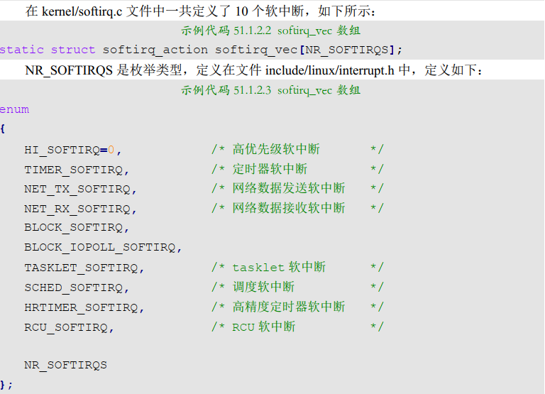

​		要使用软中断, 需要先注册对应的软中断处理函数

nr：要开启的软中断，在示例代码 51.1.2.3 中选择一个。action：软中断对应的处理函数。

返回值： 没有返回值。

```c
void open_softirq(int nr, void (*action)(struct softirq_action *))
```

注册后通过`raise_softirq`函数触发

nr：要触发的软中断，在示例代码 51.1.2.3 中选择一个。返回值： 没有返回值。  

```c
void raise_softirq(unsigned int nr)
```

软中断必须在编译的时候静态注册！ Linux 内核使用 softirq_init 函数初始化软中断， softirq _init 函数定义在 kernel/softirq.c 文件里面，函数内容如下：  

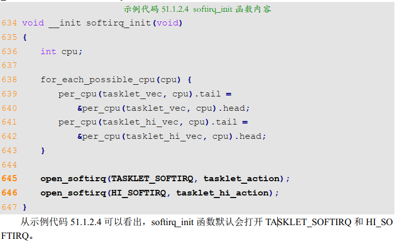

###### tasklet(利用软中断实现的另一种机制)

软中断采用轮询方式, `tasklet`采用无差别的队列机制, 有需要时才执行

**优点**

```
无类型数量限制， 效率高， 无需循环查表， 支持 SMP 机制。
一种特定类型的 tasklet 只能运行在一个 CPU 上， 不能并行， 只能串行执行。
多个不同类型的 tasklet 可以并行在多个CPU 上。
软中断是静态分配的， 在内核编译好之后， 就不能改变。
但 tasklet 就灵活许多， 可以在运行时改变，比如添加模块时 。

```

`tasklet`调用后不会立刻执行, 有一个不确定的时间后才会执行	

建议使用`tasklet`, 内核使用`taskler_struct`结构体表示,使用前需定义

```c
struct tasklet_struct
{
struct tasklet_struct *next; /* 下一个 tasklet */
unsigned long state; /* tasklet 状态 */
atomic_t count; /* 计数器，记录对 tasklet 的引用数,大于0时被禁用*/
void (*func)(unsigned long); /* tasklet 执行的函数 */
unsigned long data; /* 函数 func 的参数 */
};
```

1. tasklet_init

   t：要初始化的 tasklet 

   func： tasklet 的处理函数。

   data： 要传递给 func 函数的参数

   返回值： 没有返回值。  

   ```c
   void tasklet_init (structtasklet_struct *t,void (*func)(unsigned long),unsigned long data);
   ```

2. DECLARE_TASKLET  

   一次性完成定义和初始化

   ```c
   DECLARE_TASKLET(name, func, data)
   ```

3. tasklet_schedule

   在上半部，也就是中断处理函数中调用 tasklet_schedule 函数就能使 tasklet 在合适的时间运行  

   t：要调度的 tasklet，也就是 DECLARE_TASKLET 宏里面的 name。

   返回值： 没有返回值。  

   ```c
   void tasklet_schedule(struct tasklet_struct *t)
   ```


**tasklet使用模板**

```c
/* 定义 taselet */
struct tasklet_struct testtasklet;
 
/* tasklet 处理函数 */
void testtasklet_func(unsigned long data)
{
    /* tasklet 具体处理内容 */
}
 
/* 中断处理函数 */
irqreturn_t test_handler(int irq, void *dev_id)
{
    ......
    /* 调度 tasklet */
    tasklet_schedule(&testtasklet);
    ......
}
 
/* 驱动入口函数 */
static int __init xxxx_init(void)
{
    ......
    /* 初始化 tasklet */
    tasklet_init(&testtasklet, testtasklet_func, data);
    /* 注册中断处理函数 */
    request_irq(xxx_irq, test_handler, 0, "xxx", &xxx_dev);
    ......
}

```


###### 工作队列

在进程上下文执行(像普通线程一样运行),允许睡眠和重新调度, Linux使用`work_struct`表示一个工作

```c
struct work_struct {
atomic_long_t data;
struct list_head entry;
work_func_t func; /* 工作队列处理函数,函数指针 */
};
```

 工作队列用`workqueue_struct`结构体表示

​	内核使用工作者线程(内核线程)来处理各个工作, 使用`worker`结构体表示工作者线程

每个 worker 都有一个工作队列，工作者线程处理自己工作队列中的所有工作。

在实际的驱动开发中，我们只需要定义工作(work_struct)即可


定义之后 采用`INIT_WORK`初始化工作

_work: 初始化的工作

_func: 工作对应的处理函数

```c
#define INIT_WORK(_work, _func)
```

也可以使用`DECLARE_WORK`一次完成创建和初始化

```c
#define DECLARE_WORK(n, f)	//n:工作;f:处理函数
```

工作需要调度才能运行,在中断函数中调用

`shedule_work`

work： 要调度的工作。

返回值： 0 成功，其他值 失败。

```c
bool schedule_work(struct work_struct *work)
```

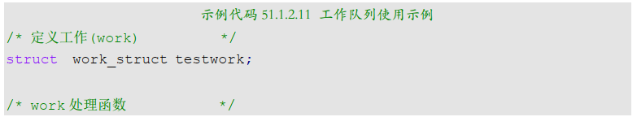

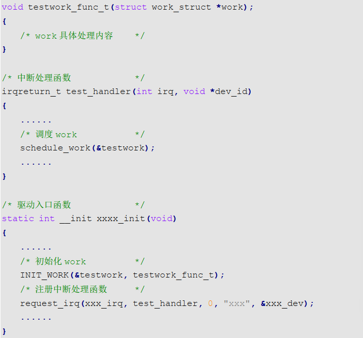

#### 设备树中断信息节点

中断相关设备树属性信息

```
#interrupt-cells，指定中断源的信息 cells 个数。
interrupt-controller，表示当前节点为中断控制器。
interrupts，指定中断号，触发方式等。
interrupt-parent，指定父中断，也就是中断控制器。
```

#### API

##### 获取中断号

`irq_of_parse_and_map`  : 获取中断号

dev： 设备节点。

index：索引号， interrupts 属性可能包含多条中断信息，通过 index 指定要获取的信息。

返回值：中断号。

```c
unsigned int irq_of_parse_and_map(struct device_node *dev,int index)
```

如果使用GPIO: `gpio_to_irq`  :获取中断号 

gpio： 要获取的 GPIO 编号。

返回值： GPIO 对应的中断号。  

```c
int gpio_to_irq(unsigned int gpio)
```

##### 申请中断函数

request_irq函数可能会导致睡眠，因此不能在中断上下文或者其他禁止睡眠的代码段中使用 request_irq 函数。
request_irq 函数会激活(使能)中断，所以不需要手动去使能中断

```C
/*
irq：要申请中断的中断号

handler：中断处理函数，当中断发生会执行此中断处理函数

flags：中断标志，可以在文件 include/linux/interrupt.h 里面查看所有的中断标志.相当于触发方式

name：中断名字，设置以后可以在/proc/interrupts 文件中看到对应的中断名字

dev： 如果将 flags 设置为 IRQF_SHARED， dev 用来区分不同的中断，一般情况下将dev 设置为设备结构体， dev 会传递给中断处理函数 irq_handler_t 的第二个参数。

返回值： 0 中断申请成功，负值中断申请失败，如果返回-EBUSY 表示中断已经被申请了
*/
int request_irq(unsigned int irq,
                irq_handler_t handler,
                unsigned long flags,
                const char *name,
                void *dev)
```

中断标志

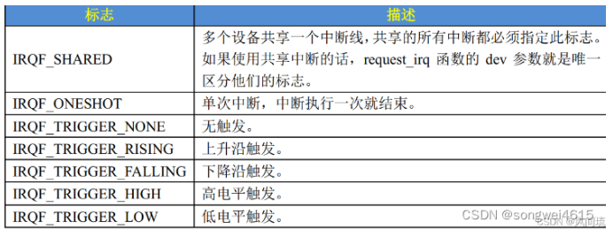

##### 中断释放函数

```c
/*
irq： 要释放的中断号
dev：如果中断设置为共享(IRQF_SHARED)，此参数用来区分具体的中断。共享中断只有在释放最后中断处理函数的时候才会被禁止掉
*/
void free_irq(unsigned int irq,void *dev)
```

##### 中断处理函数

```c
/*
第一个参数：要中断处理函数要相应的中断号

第二个参数：一个指向 void 的指针，是个通用指针，需要与 request_irq 函数的 dev 参数保持一致。用于区分共享中断的不同设备，dev 也可以指向设备数据结构

返回值：irqreturn_t 类型
*/
irqreturn_t (*irq_handler_t) (int, void *)
```

```c
enum irqreturn {
    IRQ_NONE = (0 << 0),
    IRQ_HANDLED = (1 << 0),
    IRQ_WAKE_THREAD = (1 << 1),
};
typedef enum irqreturn irqreturn_t;
```

一般中断函数使用这种返回值方式

```c
return IRQ_RETVAL(IRQ_HANDLED)
```

##### 中断使能和禁止函数

```c
void enable_irq(unsigned int irq)
void disable_irq(unsigned int irq)
void disable_irq_nosync(unsigned int irq)
```

##### 使能/关闭全局中断

```c
//这两个函数,会立即操作中断系统,这种方式存在问题
local_irq_enable()
local_irq_disable()
//一般使用一下两个函数
local_irq_save(flags)
local_irq_restore(flags)
```


### Linux阻塞与非阻塞

阻塞: 无法获取设备时,会挂起线程,应用程序打开时默认阻塞打开,

非阻塞: 无法获取设备时, 轮询等待(获取失败,返回失败码(`-EAGAIN `),继续重复获取)或者直接放弃

```c
fd = open("/dev/xxx_dev", O_RDWR | O_NONBLOCK); /* 非阻塞方式打开 */
```


#### 等待队列(wait queue)

实现阻塞进程的唤醒工作

**等待队列头**

在驱动中使用等待队列,必须先创建并初始化一个等待队列头,`wait_queue_head_t`表示, 位于`include/linux/wait.h  `

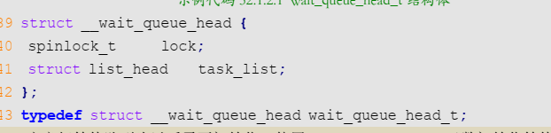

- 初始化函数

```c
void init_waitqueue_head(wait_queue_head_t *q)
```

**等待队列项**

`wait_queue_t`表示

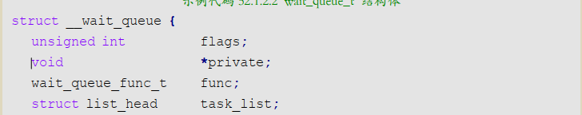


- 使用等待队列实现阻塞访问重点注意两点： 
  - 将任务或者进程加入到等待队列头， 
  - 在合适的点唤醒等待队列，一般都是中断处理函数里面。  
- 定义并初始化等待队列项

name: 等待队列项名字

tsk: 所属进程, 一般设置为current(相当于全局变量,表示当前进程)

```c
DECLARE_WAITQUEUE(name,tsk)
```

- 添加队列项

q： 等待队列项要加入的等待队列头。

wait：要加入的等待队列项。

返回值：无。

```c
void add_wait_queue(wait_queue_head_t *q,wait_queue_t *wait)
```

- 设置任务状态

添加队列项后,需要设置当前任务状态

```c
__set_current_state(TASK_INTERRUPTIBLE/TASK_UNINTERRUPTIBLE)	//可被中断唤醒/不可被中断唤醒
```

- 之后使用`schedule()`进行一次任务切换
- 移除队列项

q： 要删除的等待队列项所处的等待队列头。

wait：要删除的等待队列项。

返回值：无。

```c
void remove_wait_queue(wait_queue_head_t *q, wait_queue_t *wait)
```

- 主动唤醒

```c
//把等待队列头中所有进程都唤醒
void wake_up(wait_queue_head_t *q)	//可以环形处于 TASK_INTERRUPTIBLE 和 TASK_UNINTERRUPTIBLE 的进程
void wake_up_interruptible(wait_queue_head_t *q)		//只能唤醒处于 TASK_INTERRUPTIBLE 状态的进程
```

- 等待事件唤醒

|                           函数                           |                             描述                             |
| :------------------------------------------------------: | :----------------------------------------------------------: |
|                wait_event(wq, condition)                 | 等待以 wq 为等待队列头的等待队列被唤醒，前提是 condition 条件必须满足(为真)，否则一直阻塞。此函数会将进程设置为 TASK_UNINTERRUPTIBLE 状态 |
|        wait_event_timeout(wq, condition, timeout)        | 功能和 wait_event 类似，但是此函数可以添加超时时间，以 jiffies 为单位。此函数有返回值，如果返回 0 的话表示超时时间到，而且 condition为假。为 1 的话表示 condition 为真，也就是条件满足了。 |
|         wait_event_interruptible(wq, condition)          | 与 wait_event 函数类似，但是此函数将进程设置为 TASK_INTERRUPTIBLE，就是可以被信号打断。 |
| wait_event_interruptible_timeout(wq, condition, timeout) | 与 wait_event_timeout 函数类似，此函数也将进程设置为 TASK_INTERRUPTIBLE，可以被信号打断。 |

#### 轮询

应用程序通过`poll`,`epoll`,`select`三个函数处理轮询, 通过这三个函数查询设备是否可以操作.

##### `poll`,`epoll`,`select`

​	这三个函数会调用,设备驱动程序中的`poll`函数, 因此设备驱动程序中需要编写`poll`函数,后面有详细内容

- select函数

  单线程中,能监视的数量一般最大为1024个,可以修改内核进行更改,但效率降低

```c
int select(int nfds		//读/写/异常三类文件描述符集合中,最大的文件描述符加1,监视0~nfds-1;
			fd_set  *readfds	//指向读文件描述符集合
            fd_set  *writefds	//写文件集合
            fd_set	*exceptfds	//监视文件的异常
            struct timerval		*timeout)	//监控是否超时,为NULL时无限期等待
/*
返回值: 0，表示的话就表示超时发生，但是没有任何文件描述符可以进行操作； -1，发生
错误；其他值，可以进行操作的文件描述符个数。
*/
```

```c
struct timeval {
long tv_sec; /* 秒 */
long tv_usec; /* 微妙 */
};
```

`fd_set`类型的变量,每一位代表一个文件描述符,用一下宏进行操作

|               函数                |              功能              |
| :-------------------------------: | :----------------------------: |
|     void FD_ZERO(fd_set *set)     |          将所有位清零          |
| void FD_SET(int fd, fd_set *set)  |        设置某个fd位为1         |
| void FD_CLR(int fd, fd_set *set)  |            清零fd位            |
| int FD_ISSET(int fd, fd_set *set) | 测试某个文件描述符是否属于集合 |

- poll函数

​	和select函数差不多,但是没有最大数量限制, 随着数量增加,会效率低下,每次必须遍历所有的描述符来检查就绪的描述符 

函数原型如下

```c
//返回值：返回 revents 域中不为 0 的 pollfd 结构体个数，也就是发生事件或错误的文件描述符数量； 0，超	//时； -1，发生错误，并且设置 errno 为错误类型。
int poll(struct pollfd *fds		//要监视的文件描述符集合,以及事件, 为pollfd类型的数组
				,nfds_t nfds	//需要监视的文件描述符数量
				,int timeout)	超时时间, 单位为ms
```

pollfd类型:

```c
struct pollfd {
	int fd; /* 文件描述符 */
	short events; /* 请求的事件 */
	short revents; /* 返回的事件 */
};
```

可监视的事件类型如下

```c
POLLIN 有数据可以读取。
POLLPRI 有紧急的数据需要读取。
POLLOUT 可以写数据。
POLLERR 指定的文件描述符发生错误。
POLLHUP 指定的文件描述符挂起。
POLLNVAL 无效的请求。
POLLRDNORM 等同于 POLLIN
```

- epoll函数

处理大并发, 一般在网络编程中使用, 使用之前需要先使用下面的函数创建`epoll`句柄

```c
/*
size： 从 Linux2.6.8 开始此参数已经没有意义了，随便填写一个大于 0 的值就可以。
返回值： epoll 句柄，如果为-1 的话表示创建失败。
*/
int epoll_create(int size)
```

创建成功后就可以添加要监视的文件和事件

```c
/*
epfd： 要操作的 epoll 句柄，也就是使用 epoll_create 函数创建的 epoll 句柄。
op： 表示要对 epfd(epoll 句柄)进行的操作，可以设置为
fd：要监视的文件描述符
event： 要监视的事件类型，为 epoll_event 结构体类型指针
返回值： 0，成功； -1，失败，并且设置 errno 的值为相应的错误码。
*/
int epoll_ctl(int epfd,
				int op,
				int fd,
				struct epoll_event *event)
```

`op`可以设置为

```c
EPOLL_CTL_ADD 向 epfd 添加文件参数 fd 表示的描述符。
EPOLL_CTL_MOD 修改参数 fd 的 event 事件。
EPOLL_CTL_DEL 从 epfd 中删除 fd 描述符。
```

`epoll_event`   结构体

```c
struct epoll_event {
		uint32_t events; /* epoll 事件 */
		epoll_data_t data; /* 用户数据 */
};
```

`events`成员变量表示要监视的事件

```c
可以进行或操作,一次监视多个
EPOLLIN 有数据可以读取
EPOLLOUT 可以写数据。
EPOLLPRI 有紧急的数据需要读取。
EPOLLERR 指定的文件描述符发生错误。
EPOLLHUP 指定的文件描述符挂起。
EPOLLET 设置 epoll 为边沿触发，默认触发模式为水平触发。
EPOLLONESHOT 一次性的监视，当监视完成以后还需要再次监视某个 fd，那么就需要将fd 重新添加到 epoll 里面。
```

设置完成后可以,通过下面函数等待,事件发生

```c
/*
epfd： 要等待的 epoll。
events： 指向 epoll_event 结构体的数组，当有事件发生的时候 Linux 内核会填写 events，调
用者可以根据 events 判断发生了哪些事件。
maxevents： events 数组大小，必须大于 0。
timeout： 超时时间，单位为 ms。
返回值： 0，超时； -1，错误；其他值，准备就绪的文件描述符数量。
*/
int epoll_wait(int epfd,
				struct epoll_event *events,
				int maxevents,
				int timeout)
```


##### 驱动中的poll函数

调用select/poll函数时,file_operations中的poll函数会执行, 调用 驱动程序中对应的poll函数,原型如下

```c
/*
filp： 要打开的设备文件(文件描述符)。
wait： 结构体 poll_table_struct 类型指针， 由应用程序传递进来的。一般将此参数传poll_wait 函数。
返回值:向应用程序返回设备或者资源状态
*/
unsigned int (*poll) (struct file *filp, struct poll_table_struct *wait)
```

可以返回的状态如下

```c
POLLIN 有数据可以读取。
POLLPRI 有紧急的数据需要读取。
POLLOUT 可以写数据。
POLLERR 指定的文件描述符发生错误。
POLLHUP 指定的文件描述符挂起。
POLLNVAL 无效的请求。
POLLRDNORM 等同于 POLLIN，普通数据可读
```

需要在poll函数中调用`poll_wait`函数, 不会引起阻塞,只是将应用程序,添加到`poll_table`中, 函数原型如下

```c
/*
参数 wait_address 是要添加到 poll_table 中的等待队列头，参数 p 就是 poll_table，就是 file
_operations 中 poll 函数的 wait 参数。
*/
void poll_wait(struct file * filp, wait_queue_head_t * wait_address, poll_table *p)
```


### 异步通知实验

驱动程序主动向应用程序发出通知, 告知其可以使用

​	异步通知的核心是信号, 定义于`arch/xtensa/include/uapi/asm/signal.h  `, 信号相当于中断, 不同的信号,代表不同的中断, 使用信号需要设置对应的信号处理函数,

```c
#define SIGHUP 1 /* 终端挂起或控制进程终止 */
#define SIGINT 2 /* 终端中断(Ctrl+C 组合键) */
#define SIGQUIT 3 /* 终端退出(Ctrl+\组合键) */
#define SIGILL 4 /* 非法指令 */
#define SIGTRAP 5 /* debug 使用，有断点指令产生 */
#define SIGABRT 6 /* 由 abort(3)发出的退出指令 */
#define SIGIOT 6 /* IOT 指令 */
#define SIGBUS 7 /* 总线错误 */
#define SIGFPE 8 /* 浮点运算错误 */
#define SIGKILL 9 /* 杀死、终止进程 */
#define SIGUSR1 10 /* 用户自定义信号 1 */
#define SIGSEGV 11 /* 段违例(无效的内存段) */
#define SIGUSR2 12 /* 用户自定义信号 2 */
#define SIGPIPE 13 /* 向非读管道写入数据 */
#define SIGALRM 14 /* 闹钟 */
#define SIGTERM 15 /* 软件终止 */
#define SIGSTKFLT 16 /* 栈异常 */
#define SIGCHLD 17 /* 子进程结束 */
#define SIGCONT 18 /* 进程继续 */
#define SIGSTOP 19 /* 停止进程的执行，只是暂停 */
#define SIGTSTP 20 /* 停止进程的运行(Ctrl+Z 组合键) */
#define SIGTTIN 21 /* 后台进程需要从终端读取数据 */
#define SIGTTOU 22 /* 后台进程需要向终端写数据 */
#define SIGURG 23 /* 有"紧急"数据 */
#define SIGXCPU 24 /* 超过 CPU 资源限制 */
#define SIGXFSZ 25 /* 文件大小超额 */
#define SIGVTALRM 26 /* 虚拟时钟信号 */
#define SIGPROF 27 /* 时钟信号描述 */
#define SIGWINCH 28 /* 窗口大小改变 */
#define SIGIO 29 /* 可以进行输入/输出操作 */
#define SIGPOLL SIGIO
/* #define SIGLOS 29 */
#define SIGPWR 30 /* 断点重启 */
#define SIGSYS 31 /* 非法的系统调用 */
#define SIGUNUSED 31 /* 未使用信号 */
```

- 设置指定信号的处理函数

signum：要设置处理函数的信号。

handler： 信号的处理函数。

返回值： 设置成功的话返回信号的前一个处理函数，设置失败的话返回 SIG_ERR。

```c
sighandler_t signal(int signum, sighandler_t handler)
```

- 信号处理函数

```c
typedef void (*sighandler_t)(int)
```

#### 驱动中的信号处理

需要定义一个`fasync_struct`结构体指针变量, 一般定义到设备结构体中

```c
struct fasync_struct {
            spinlock_t fa_lock;
            int magic;
            int fa_fd;
            struct fasync_struct *fa_next;
            struct file *fa_file;
            struct rcu_head fa_rcu;
};
```

- fasync函数

需要自行实现file_operations 操作集中的 fasync 函数, 

```c
int (*fasync)(int fd, struct file *filp, int on)
```

该函数中一般通过调用`fasync_helper`初始化前面定义的`fasync_struct`结构体指针

```c
int fasync_helper(int fd, struct file * filp, int on, struct fasync_struct **fapp)
```

关闭驱动时,需要在release函数中释放`fasync_struct`,本质还是通过`fasync_helper`

```c
return xxx_fasync(-1, filp, 0); /* 删除异步通知 */
```

- `kill_fasync`函数

负责发送指定的信号,相当于发送中断信号

```c
fp：要操作的 fasync_struct。
sig： 要发送的信号。
band： 可读时设置为 POLL_IN，可写时设置为 POLL_OUT。
返回值： 无。
void kill_fasync(struct fasync_struct **fp, int sig, int band)
```

#### 应用程序对异步通知的处理

1. 注册信号处理函数
   根据驱动的信号,用`signal`函数来设置信号的处理函数

2. 把应用程序的进程号通知内核
   使用 fcntl(fd, F_SETOWN, getpid())将本应用程序的进程号告诉给内核。  

3. 开启异步通知

   ```c
   flags = fcntl(fd, F_GETFL); /* 获取当前的进程状态 */
   fcntl(fd, F_SETFL, flags | FASYNC); /* 开启当前进程异步通知功能 */
   ```

   重点就是通过 fcntl 函数设置进程状态为 FASYNC，经过这一步，驱动程序中的 fasync 函数就会执行。  


### platform设备驱动实验

​	对于复杂外设的驱动,需要驱动的分离与分层(为了重用), 一下内容,针对Linux下的驱动分离和分层, 以及`platform`架构下的设备驱动编写

设备和驱动都需要挂载在一种总线上,对于使用`i2c\spi\usb\pci`等的设备,可以之直接挂载到对应总线上,而`platform`虚拟总线是面向集成在SOC内部的独立外设控制器

```
总线所必需的条件:
有标准的物理连接方式（I2C有SDA/SCL两根线，SPI有4根线）

有标准的通信协议（I2C有起始条件、地址、读写位等）

可以挂多个设备（同一I2C总线上可以挂多个不同地址的设备）

设备可以枚举/发现（USB/PCI可以热插拔并自动发现）
```


- ​	驱动的分隔, 将主机驱动和设备驱动分隔开,对应了Linux中的总线(bus,通用接口). 驱动(driver,主机驱动). 设备(device,设备驱动)

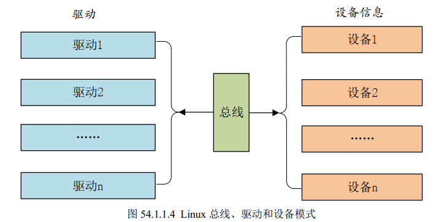

- ​	驱动的分层(input子系统为例)

1. 最底层是设备原始驱动, 负责获取原始内容
2. 获取到的内容,传递给核心层, 核心层处理各种IO模型,提供`file_operations`结构体,驱动只负责将内容上报

#### platform平台模型

- platform总线

内核使用`bus_type`结构体表示总线,定义于`include/linux/device.h`

```c
struct bus_type {
        const char *name; /* 总线名字 */
        const char *dev_name;
        struct device *dev_root;
        struct device_attribute *dev_attrs;
        const struct attribute_group **bus_groups; /* 总线属性 */
        const struct attribute_group **dev_groups; /* 设备属性 */
        const struct attribute_group **drv_groups; /* 驱动属性 */
        int (*match)(struct device *dev, struct device_driver *drv);	//重要,通过这个函数匹配驱动与设备
        int (*uevent)(struct device *dev, struct kobj_uevent_env *env);
        int (*probe)(struct device *dev);	/*当驱动和设备匹配成功以后此函数就会执行，以前在驱动
											入口 init 函数里面编写的字符设备驱动程序就全部放到此 												probe 函数里面。比如注册字符设备驱动、添加 cdev、创												建类等等*/
        int (*remove)(struct device *dev);
        void (*shutdown)(struct device *dev);
        int (*online)(struct device *dev);
        int (*offline)(struct device *dev);
        int (*suspend)(struct device *dev, pm_message_t state);
        int (*resume)(struct device *dev);
        const struct dev_pm_ops *pm;
        const struct iommu_ops *iommu_ops;
        struct subsys_private *p;
        struct lock_class_key lock_key;
};
```

`platform`总线定义于 `drivers/base/platform.c` 

```c
struct bus_type platform_bus_type = {
        .name = "platform",
        .dev_groups = platform_dev_groups,
        .match = platform_match,
        .uevent = platform_uevent,
        .pm = &platform_dev_pm_ops,
};
```

`platform`的四种匹配方式

1. OF类型匹配: 设备树匹配,通过`compatible`属性的匹配
2. ACPI匹配
3. id_table: 每个 platform_driver 结构体有一个 id_table成员变量，顾名思义，保存了很多 id 信息。这些 id 信息存放着这个 platformd 驱动所支持的驱动类型。  
4. 如果id_table 不存在的话就直接比较驱动和设备的 name 字段，看看是不是相等，如果相等的话就匹配成功  


##### `platform`驱动

`platform_driver` 结构体表示 `platform` 驱动，此结构体定义在文件 `include/linux/platform_device.h`   

```c
struct platform_driver {
        int (*probe)(struct platform_device *);		/*匹配成功后执行,非常重要,一般会提供,如果实现															全新的驱动,需要自己编写*/
        int (*remove)(struct platform_device *);
        void (*shutdown)(struct platform_device *);
        int (*suspend)(struct platform_device *, pm_message_t state);
        int (*resume)(struct platform_device *);
        struct device_driver driver;		/*device_driver 相当于基类，提供了最基础的驱动框架*/
        const struct platform_device_id *id_table;	/*id_table,第三种匹配方式,是数组,元素类型为														platform_device_id*/
        bool prevent_deferred_probe;
};
```

成员内容:

```c
struct platform_device_id {
        char name[PLATFORM_NAME_SIZE];
        kernel_ulong_t driver_data;
};

struct device_driver {
        const char *name;
        struct bus_type *bus;
        struct module *owner;
        const char *mod_name; /* used for built-in modules */
        bool suppress_bind_attrs; /* disables bind/unbind via sysfs */
        const struct of_device_id *of_match_table;		/*of匹配使用的匹配表,数组成员为of_device_id结构体*/
        const struct acpi_device_id *acpi_match_table;
        int (*probe) (struct device *dev);
        int (*remove) (struct device *dev);
        void (*shutdown) (struct device *dev);
        int (*suspend) (struct device *dev, pm_message_t state);
        int (*resume) (struct device *dev);
        const struct attribute_group **groups;
        const struct dev_pm_ops *pm;
        struct driver_private *p;
};


struct of_device_id {
            char name[32];
            char type[32];
            char compatible[128];			//"compatible"属性
            const void *data;
};


```

- 相关函数

​	编写platform驱动需要定义`platform_driver`结构体变量, 然后实现结构体中的成员变量,重点是**匹配方法和`probe`函数**, 具体的驱动程序在probe函数中编写

​	定义,并初始化好,`platform_driver`之后需要向Linux内核**注册一个`platform`驱动,** 

```c
/*
driver：要注册的 platform 驱动。
返回值： 负数，失败； 0，成功。
*/
int platform_driver_register (struct platform_driver *driver)
```

需要在驱动卸载函数中**卸载`platform`驱动**

```c
/*
drv：要卸载的 platform 驱动。
返回值： 无。
*/
void platform_driver_unregister(struct platform_driver *drv)
```

`platform`驱动框架: <正点原子驱动 P1341>

##### `platform`设备

​	`platform_device` 这个结构体表示 platform 设备，这里我们要注意，如果内核支持设备树的话就不要再使用 platform_device 来描述设备了，因为改用设备树去描述了。当然了，你如果一定要用 platform_device 来描述设备信息的话也是可以`platform_device` 结构体定义在文件`include/linux/platform_device.h` 中，结构体内容如下：  

```c
struct platform_device {	
        const char *name;		//设备名字,要和驱动name字段相同
        int id;
        bool id_auto;
        struct device dev;
        u32 num_resources;		//资源数量
        struct resource *resource;		//资源,设备信息,比如外设寄存器
        const struct platform_device_id *id_entry;
        char *driver_override; /* Driver name to force a match */
        /* MFD cell pointer */
        struct mfd_cell *mfd_cell;
        /* arch specific additions */
        struct pdev_archdata archdata;
};
```

成员变量

```c
struct resource {
        resource_size_t start;
        resource_size_t end;		//资源的起止信息
        const char *name;			//资源名称
        unsigned long flags;		//资源类型
        struct resource *parent, *sibling, *child;
};

//资源类型
#define IORESOURCE_BITS 0x000000ff /* Bus-specific bits */
#define IORESOURCE_TYPE_BITS 0x00001f00 /* Resource type */
#define IORESOURCE_IO 0x00000100 /* PCI/ISA I/O ports */
#define IORESOURCE_MEM 0x00000200
#define IORESOURCE_REG 0x00000300 /* Register offsets */
#define IORESOURCE_IRQ 0x00000400
#define IORESOURCE_DMA 0x00000800
#define IORESOURCE_BUS 0x00001000
...
/* PCI control bits. Shares IORESOURCE_BITS with above PCI ROM. */
#define IORESOURCE_PCI_FIXED (1<<4) /* Do not move resource */
```

在以前不支持设备树的Linux版本中，用户需要编写platform_device变量来描述设备信息  ,支持设备树后就不再需要

- 注册设备信息
  pdev：要注册的 platform 设备。

  返回值： 负数，失败； 0，成功。  

  ```c
  int platform_device_register(struct platform_device *pdev)
  ```

- 注销设备

pdev：要注销的 platform 设备。

返回值： 无。

```c
void platform_device_unregister(struct platform_device *pdev)
```

platform 设备信息框架:正点原子P1345

该框架应用于不支持设备树的Linux版本,支持设备树时,内核启动时,会从设备树中,读取信息,将其组织成`platform_device`形式,本章的代码编写,采用自定义`platform_device`的形式,因此,不进行编写,编写采用设备树的代码

### 设备树下的platform驱动编写

​	`platform`驱动分为总线, 设备, 驱动,  总线我们不需要理解, 只需要关注设备和驱动的具体实现.	没有设备树时我们需要分别编写并注册 `platform_device` 和 `platform_driver`，分别代表设备和驱动  , 使用设备树时,只需要实现`platform_driver`即可,基于设备树,需要注意以下几点:

- 设备树中创建设备节点
- 注意兼容属性, 用设备树进行设备匹配, 即使用`of_match_table`

第 1~4 行， of_device_id 表，也就是驱动的兼容表，是一个数组，每个数组元素为 of_devic e_id 类型。每个数组元素都是一个兼容属性，表示兼容的设备，一个驱动可以跟多个设备匹配。这里我们仅仅匹配了一个设备，那就是 55.1.1 中创建的 gpioled 这个设备。第 2 行的 compatible值为“atkalpha-gpioled”，驱动中的 compatible 属性和设备中的 compatible 属性相匹配，因此驱动中对应的 probe 函数就会执行。注意第 3 行是一个空元素，在编写 of_device_id 的时候最后一个元素一定要为空！

第 6 行，通过 MODULE_DEVICE_TABLE 声明一下 leds_of_match 这个设备匹配表

第 11 行，设置 platform_driver 中的 of_match_table 匹配表为上面创建的 leds_of_match，至此我们就设置好了 platform 驱动的匹配表了。

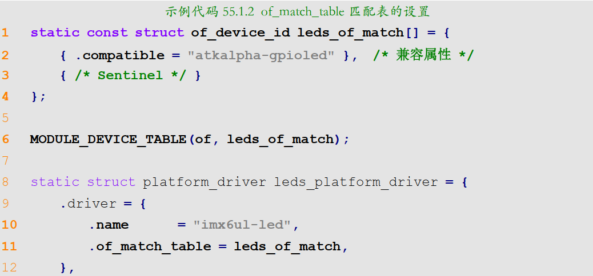

​		

- 编写platform驱动

​	当驱动和设备匹配成功以后就会执行 probe 函数。我们需要在 probe 函数里面执行字符设备驱动那一套，当注销驱动模块的时候 remove 函数就会执行，都是大同小异的。  

### Linux自带的led灯驱动实验

​	对于led这种基础的设备驱动,内核有着对应的驱动, 只需要按照要求,在设备树中手动添加相应的led节点即可, 内核的led驱动采用的是platform框架.使用步骤

#### 使用方法

- 首先需要使能自带的驱动

  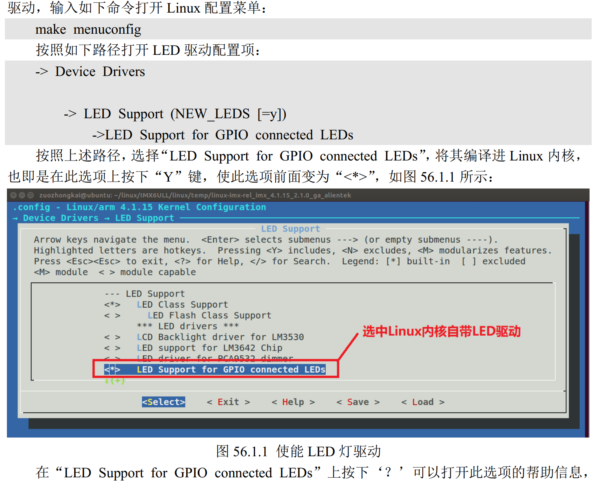

​	led灯的驱动文件为`/drivers/leds/leds-gpio.c`, 需要根据驱动文件中的配置属性, 添加相应的节点,

 该文件中,驱动通过`module_platform_driver`函数向Linux内核注册platform驱动

```c
//module_platform_driver:本质是宏定义,展开之后如下,就是标准的注册和删除

static int __init gpio_led_driver_init(void)
{
	return platform_driver_register (&(gpio_led_driver));
}
module_init(gpio_led_driver_init);

static void __exit gpio_led_driver_exit(void)
{
	platform_driver_unregister (&(gpio_led_driver) );
}
module_exit(gpio_led_driver_exit);
```

#### 设备树节点的编写

​	`Documentation/devicetree/bindings/leds/leds-gpio.txt  `该文件讲解了如何编写内核驱动对应的设备节点

- 注意事项
  1. 创建一个节点表示一类设备,如果有多个这种设备,每一个都当作他的子节点
  2. 父节点的`compatible`属性值一定要为,驱动文件中对应的内容
  3. 设置 label 属性，此属性为可选，每个子节点都有一个 label 属性， label 属性一般表示LED 灯的名字，比如以颜色区分的话就是 red、 green 等等  
  4. 每个子节点必须设置`gpios`属性值,表示所使用的gpio引脚
  5. 可以通过`linux,default-trigger`属性值设置,led的默认功能, `Documentation/devicetree/bindings/leds/common.txt   `可以通过这个文档查询,可选的功能
  6. 可以设置“default-state”属性值，可以设置为 on、 off 或 keep，为 on 的时候 LED 灯默认打开，为 off 的话 LED 灯默认关闭，为 keep 的话 LED 灯保持当前模式  

### MISC实验

​	杂项驱动, 无法进行分类的外设驱动, 其实就是最简单的字符设备驱动,一般嵌套在platform总线驱动中, 实现复杂的驱动

- 所有的MISC设备的主设备号都是10, 从设备号不同.

  自动创建cdev,无需手动,  需要注册一个`miscdevice`设备,定义于`include/linux/miscdevice.h  `

  ```c
  struct miscdevice {
          int minor; /* 子设备号 */
          const char *name; /* 设备名字 */
          const struct file_operations *fops; /* 设备操作集,需要设置以上三个成员变量 */	
          struct list_head list;
          struct device *parent;
          struct device *this_device;
          const struct attribute_group **groups;
          const char *nodename;
          umode_t mode;
  };
  ```

  子设备号,可以使用预定义的,也可以使用,自定义的,没用过就行,

  ```c
  				示例代码 57.1.2 预定义的 MISC 设备子设备号
  13 #define PSMOUSE_MINOR 1
  14 #define MS_BUSMOUSE_MINOR 2 /* unused */
  15 #define ATIXL_BUSMOUSE_MINOR 3 /* unused */
  16 /*#define AMIGAMOUSE_MINOR 4 FIXME OBSOLETE */
  17 #define ATARIMOUSE_MINOR 5 /* unused */
  18 #define SUN_MOUSE_MINOR 6 /* unused */
  ......
  52 #define MISC_DYNAMIC_MINOR 255
  ```

#### misc设备相关函数

- misc_register  

  ```c
  /*
  	向内核注册设备
      misc：要注册的 MISC 设备。
      返回值： 负数，失败； 0，成功。
  */
  int misc_register(struct miscdevice * misc)
  ```

- misc_deregister

  ```c
  /*
  	注销设备
  	misc：要注销的 MISC 设备。
  	返回值： 负数，失败； 0，成功
  */
  int misc_deregister(struct miscdevice *misc)
  ```

  这两个函数,代替了以往复杂的手动创建/删除设备的过程

  #### 程序编写

  和platform驱动类似,只是不需要手动创建设备,删除设备的过程

### input子系统

#### input子系统

​	本质上是字符设备,只是将输入设备套上了`input`子系统的框架,

​	用户只需要: 上报事件(按键值,坐标等),`input`核心层负责处理

​	**子系统分层:**

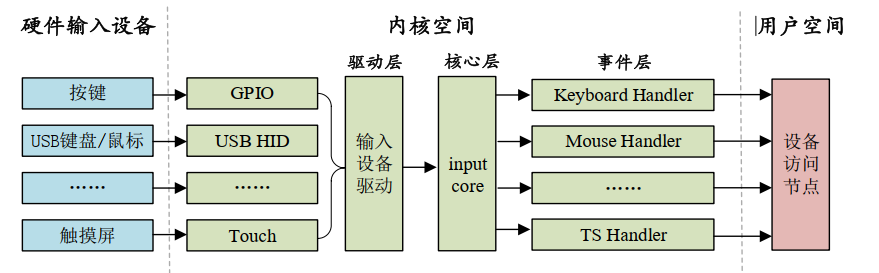

##### 驱动编写流程

​	`input`核心层会向内核注册一个字符设备,所有`input`子系统的主设备号都是13,

​	使用时只需要 , 向内核注册一个`input_device`即可

​	`input_dev`表示input设备,位于`include/linux/input.h   `

```c
struct input_dev {
        const char *name;
        const char *phys;
        const char *uniq;
        struct input_id id;
        unsigned long propbit[BITS_TO_LONGS(INPUT_PROP_CNT)];
        unsigned long evbit[BITS_TO_LONGS(EV_CNT)]; /* 事件类型的位图 */
        unsigned long keybit[BITS_TO_LONGS(KEY_CNT)]; /* 按键值的位图 */
        unsigned long relbit[BITS_TO_LONGS(REL_CNT)]; /* 相对坐标的位图 */
        unsigned long absbit[BITS_TO_LONGS(ABS_CNT)]; /* 绝对坐标的位图 */
        unsigned long mscbit[BITS_TO_LONGS(MSC_CNT)]; /* 杂项事件的位图 */
        unsigned long ledbit[BITS_TO_LONGS(LED_CNT)]; /*LED 相关的位图 */
        unsigned long sndbit[BITS_TO_LONGS(SND_CNT)];/* sound 有关的位图 */
        unsigned long ffbit[BITS_TO_LONGS(FF_CNT)]; /* 压力反馈的位图 */
        unsigned long swbit[BITS_TO_LONGS(SW_CNT)]; /*开关状态的位图 */
        ..
        bool devres_managed;
};
```

成员变量:

```c
//evbit
    #define EV_SYN 0x00 /* 同步事件 */
    #define EV_KEY 0x01 /* 按键事件 */
    #define EV_REL 0x02 /* 相对坐标事件 */
    #define EV_ABS 0x03 /* 绝对坐标事件 */
    #define EV_MSC 0x04 /* 杂项(其他)事件 */
    #define EV_SW 0x05 /* 开关事件 */
    #define EV_LED 0x11 /* LED */
    #define EV_SND 0x12 /* sound(声音) */
    #define EV_REP 0x14 /* 重复事件 */
    #define EV_FF 0x15 /* 压力事件 */
    #define EV_PWR 0x16 /* 电源事件 */
    #define EV_FF_STATUS 0x17 /* 压力状态事件 */
//keybit
        #define KEY_RESERVED 	0
        #define KEY_ESC	 		1
        #define KEY_1 			2
        #define KEY_2			3
        #define KEY_3 			4
        #define KEY_4 			5
        #define KEY_5 			6	
        #define KEY_6 			7
        #define KEY_7 			8
        #define KEY_8 			9
        #define KEY_9 			10
        #define KEY_0 			11
        ...
        #define BTN_TRIGGER_HAPPY39			 0x2e6
        #define BTN_TRIGGER_HAPPY40 		 0x2e7
```

##### input子系统函数

###### 注册input_dev

- input_allocate_device

  ```c
  /*
  	申请input_dev,申请好后需要进行初始化,主要为事件类型(evbit)和事件值(keybit)这两种
  	参数：无。
  	返回值： 申请到的 input_dev。
  */
  struct input_dev *input_allocate_device(void)
  ```

- input_free_device  

  ```c
  /*
  	释放input_dev
  	dev：需要释放的 input_dev。
  	返回值： 无。
  */
  void input_free_device(struct input_dev *dev)
  ```

- input_register_device  

  ```c
   /*
   	向内核注册input_dev
   	dev：要注册的 input_dev 。
  	返回值： 0， input_dev 注册成功；负值， input_dev 注册失败。
   */
  int input_register_device(struct input_dev *dev)
  ```

- input_unregister_device

  ```c
  /*
  	注销input_dev
      dev：要注销的 input_dev 。
      返回值： 无。
  */
  void input_unregister_device(struct input_dev *dev)
  ```

  `input_dev`注册过程

```c
/*
①、使用 input_allocate_device 函数申请一个 input_dev。
②、初始化 input_dev 的事件类型以及事件值。	
③、使用 input_register_device 函数向 Linux 系统注册前面初始化好的 input_dev。
④、卸载 input 驱动的时候需要先使用 input_unregister_device 函数注销掉注册的 input_dev，然后使用 input_free_device 函数释放掉前面申请的 input_dev。 input_dev 注册过程示例代码
*/
```

​	初始化`input_dev`的方法有三种

1. ```c
   /*********第一种设置事件和事件值的方法***********/
   __set_bit(EV_KEY, inputdev->evbit); /* 设置产生按键事件 */
   __set_bit(EV_REP, inputdev->evbit); /* 重复事件 */
   __set_bit(KEY_0, inputdev->keybit); /*设置产生哪些按键值 */
   ```

2. ```c
   /*********第二种设置事件和事件值的方法***********/
   keyinputdev.inputdev->evbit[0] = BIT_MASK(EV_KEY) |BIT_MASK(EV_REP);
   keyinputdev.inputdev->keybit[BIT_WORD(KEY_0)] |=BIT_MASK(KEY_0);
   ```

3. ```c
   /*********第三种设置事件和事件值的方法***********/
   keyinputdev.inputdev->evbit[0] = BIT_MASK(EV_KEY) |BIT_MASK(EV_REP);
   input_set_capability(keyinputdev.inputdev, EV_KEY, KEY_0);
   ```

###### 上报输入事件

注册`input_dev`之后,要获取到具体的事件值,将其上报之后才能正确处理

- input_event

  ```c
  /*
  	上报指定的事件和对应的值,可以上报所有的类型和值
  	dev：需要上报的 input_dev。
      type: 上报的事件类型，比如 EV_KEY。
      code： 事件码，也就是我们注册的按键值，比如 KEY_0、 KEY_1 等等。
      value：事件值，比如 1 表示按键按下， 0 表示按键松开。
      返回值： 无
  */
  void input_event(struct input_dev *dev,unsigned int type,unsigned int code,int value)
  ```
  
- 其余的上报函数

  这些函数的本质都是调用了,`input_event`

  ```c
  void input_report_rel(struct input_dev *dev, unsigned int code, int value)
  void input_report_abs(struct input_dev *dev, unsigned int code, int value)
  void input_report_ff_status(struct input_dev *dev, unsigned int code, int value)
  void input_report_switch(struct input_dev *dev, unsigned int code, int value)
  void input_mt_sync(struct input_dev *dev)
  ```

- input_sync

  上报函数之后,需要使用这个函数,告诉内核上报结束

  ```c
  /*
  	dev：需要上报同步事件的 input_dev。
  	返回值： 无。
  */
  void input_sync(struct input_dev *dev)
  ```

Linux 内核使用 `input_event` 这个结构体来表示所有的输入事件  ,定义于 `include/uapi/linux/input.h`

所有的输入设备最终都是按照 `input_event` 结构体呈现给用户的  ,这个结构体非常重要

```c
struct input_event {
        struct timeval time;
        __u16 type;
        __u16 code;
        __s32 value;
};

//成员变量
typedef long __kernel_long_t;
typedef __kernel_long_t __kernel_time_t;
typedef __kernel_long_t __kernel_suseconds_t;
struct timeval {
        __kernel_time_t tv_sec; /* 秒,32位 */
        __kernel_suseconds_t tv_usec; /* 微秒,32位 */
};
```


#### 内核自带按键驱动程序

​	该程序使用了`platform`框架, 并使用`input`子系统上报事件,使用自带驱动,需要按照参考`Documentation/devicetree/bindi ngs/input/gpio-keys.txt`,在设备树中添加设备节点

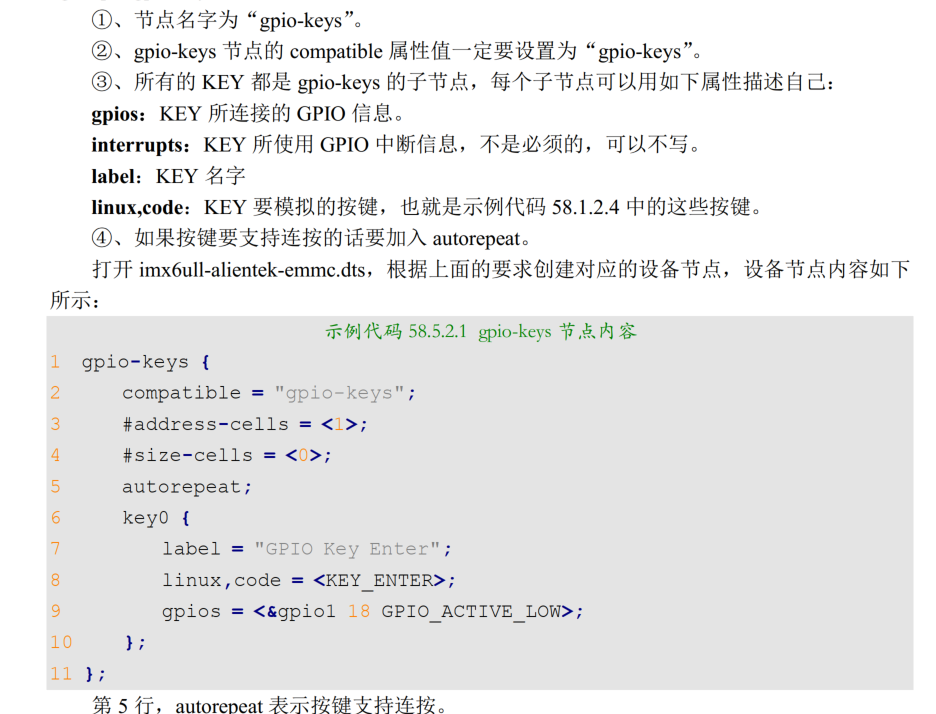

### Linux下的LCD驱动实验

`Framebuffer` :帧缓冲, 简称`fb`是一种机制, 将所有个显示有关的软硬件都集中起来,虚拟出一个`fb`设备,驱动程序写好后,会有这样一个设备`/dev/fbX(0~n)`,直接访问这个就可以访问LCD

​	是字符设备, `file_operations`位于`drivers/video/fbdev/core/fbmem.c  `

​	不同分辨率的 LCD 屏幕其 eLCDIF 控制器驱动代码都是一样的, 重点内容是修改对应的屏幕参数, 把参数信息放到设备树中.

##### 	Framebuffer驱动	

​	linux下lcd驱动使用platform驱动

​	Linux 内核将所有的 `Framebuffer` 抽象为一个叫做 `fb_info` 的结构体  ,LCD的驱动就是构建`fb_info`

```c
struct fb_info {
        atomic_t count;
        int node;
        int flags;
        struct mutex lock; /* 互斥锁 */
        struct mutex mm_lock; /* 互斥锁，用于 fb_mmap 和 smem_*域*/
        struct fb_var_screeninfo var; /* 当前可变参数 */
        struct fb_fix_screeninfo fix; /* 当前固定参数 */
        struct fb_monspecs monspecs; /* 当前显示器特性 */
        struct work_struct queue; /* 帧缓冲事件队列 */
        struct fb_pixmap pixmap; /* 图像硬件映射 */
        struct fb_pixmap sprite; /* 光标硬件映射 */
        struct fb_cmap cmap; /* 当前调色板 */
        struct list_head modelist; /* 当前模式列表 */
        struct fb_videomode *mode; /* 当前视频模式 */
    
    #ifdef CONFIG_FB_BACKLIGHT /* 如果 LCD 支持背光的话 */
        /* assigned backlight device */
        /* set before framebuffer registration,
        remove after unregister */
        struct backlight_device *bl_dev; /* 背光设备 */
        /* Backlight level curve */
        struct mutex bl_curve_mutex;
        u8 bl_curve[FB_BACKLIGHT_LEVELS];
    #endif
        ...
        struct fb_ops *fbops; /* 帧缓冲操作函数集 */
        struct device *device; /* 父设备 */
        struct device *dev; /* 当前 fb 设备 */
        int class_flag; /* 私有 sysfs 标志 */
        ...
        char __iomem *screen_base; /* 虚拟内存基地址(屏幕显存) */
        unsigned long screen_size; /* 虚拟内存大小(屏幕显存大小) */
        void *pseudo_palette; /* 伪 16 位调色板 */
        ...
};
```

​	LCD的platform中的probe函数实现以下功能

```c
①、申请 fb_info。
②、初始化 fb_info 结构体中的各个成员变量。
③、初始化 eLCDIF 控制器。
④、使用 register_framebuffer 函数向 Linux 内核注册初始化好的 fb_info。
```

- register_framebuffer

  ```c
  /*
      向 Linux 内核注册初始化好的 fb_info
      fb_info：需要上报的 fb_info。
      返回值： 0，成功；负值，失败
  */
  int register_framebuffer(struct fb_info *fb_info)
  ```

  正点原子P1421  有nxp官方给出的lcd的platform框架下的probe函数实现


官方已经把`eLCDIDF`接口驱动程序写好了,因此驱动部分,不需要去更改了,需要做的就是按照使用的LCD来修改设备树,

修改以下内容:

1. 屏幕使用的IO口
2. 屏幕的节点修改属性值, 更改为当前使用的参数
3. 背光节点信息修改,根据实际使用的IO口修改节点信息

IO配置官方已经给出,不需要进行修改

##### **IO配置解读**

子节点`pinctrl_lcdif_dat `是RGB(888)的24根数据线配置;

子节点`pinctrl_lcdif_ctrl`是四根控制线配置,  包括 CLK、 ENABLE、 VSYNC 和 HSYNC  

子节点`pinctrl_pwm1`背光pwm引脚配置..   这里最好背光IO和厂商官方一致

##### 屏幕参数节点修改

​	`pinctrl-0`属性. LCD使用的IO信息,正点原子板子没有用到复位IO,可以删掉

​	`display`属性,指定LCD属性在的子节点,指定在`display0`节点, 该节点就在`display`下方.

​	`display0`节点 描述参数信息

​		 `bits-per-pixel`描述一个像素点占用几个位, 本屏幕应该将其设置为24(RGB888).

​		`bus_width`设置数据线宽度,这里要和像素占用位数相同

##### 背光节点修改

1. 修改`pinctrl_pwm1`节点配置IO
2. 在dts中向`pwm1`节点增加/修改信息
3. 参考文档`Documentation/devicetree/indings/video/backlight/pwm-backlight.txt  `添加`blacklight`节点


**使能logo显示**

图形化配置窗口中,找到以下内容

```c
-> Device Drivers
    -> Graphics support
        -> Bootup logo (LOGO [=y])
            -> Standard black and white Linux logo	//黑白
            -> Standard 16-color Linux logo		//16位色彩格式
            -> Standard 224-color Linux logo	//24位色彩格式
```

##### 设置LCD作为终端

1. ​	修改uboot中的`bootargs`参数中的console内容

   ```c
   setenv bootargs 'console=tty1 console=ttymxc0,115200 root=/dev/nfs rw nfsroot=192.168.1.250:/home/zuozhongkai/linux/nfs/rootfs 		ip=192.168.1.251:192.168.1.250:192.168.1.1:255.255.255.0::eth0:off'			//设置了两遍console 分辨设置lcd和串口为控制台
   ```

2. 修改`/etc/inittab`文件

   输入下列指令

   ```c
   tty1::askfirst:-/bin/sh				//开启tty1,设置lcd作为终端
   ```

**背光调节**

​	Linux设置了8个级别的背光等级,分别对应`0%、 1.57%、 3.13%、 6.27%、 12.55%、 25.1%、 50.19%、 100%  `的占空比

​	可以向以下文件夹中的`brightness`写入`0~7`的数字进行修改,该参数对应了当前的亮度等级

```c
/sys/devices/platform/backlight/backlight/backligh
```

**lcd自动熄屏解决方法**

1. 在源码中找到`drivers/tty/vt/vt.c `这个文件  ,修改`blank interval`变量, 该变量控制熄屏时间, 修改为0,关闭熄屏;

2. 写一个文件,控制屏幕关闭熄屏

   ```c
   #include <fcntl.h>
   #include <stdio.h>
   #include <sys/ioctl.h>
   int main(int argc, char *argv[])
   {
   int fd;
   fd = open("/dev/tty1", O_RDWR);
   write(fd, "\033[9;0]", 8);
   close(fd);
   return 0;
   }
   ```

   把该文件编译后的内容放在`/usr/bin`目录下,在`/etc/init.d/rcS  `文件中添加

   ```shell
   cd /usr/bin
   ./lcd_always_on
   cd..
   ```


### 内核RTC

​	RTC设备抽象为`rtc_device`结构体, 驱动本质就是申请,并初始化结构体,最后将其注册到内核中

```c
// include/linux/rtc.h
struct rtc_device
{
        struct device dev; /* 设备 */
        struct module *owner;
        int id; /* ID */
        char name[RTC_DEVICE_NAME_SIZE]; /* 名字 */
        const struct rtc_class_ops *ops; /* RTC 设备底层操作函数 */
        struct mutex ops_lock;
        struct cdev char_dev; /* 字符设备 */
        unsigned long flags;
        unsigned long irq_data;
        spinlock_t irq_lock;
        wait_queue_head_t irq_queue;
        struct fasync_struct *async_queue;
        struct rtc_task *irq_task;
        spinlock_t irq_task_lock;
        int irq_freq;
        int max_user_freq;
        struct timerqueue_head timerqueue;
        struct rtc_timer aie_timer;
        struct rtc_timer uie_rtctimer;
        struct hrtimer pie_timer; /* sub second exp, so needs hrtimer */
        int pie_enabled;
        struct work_struct irqwork;
        /* Some hardware can't support UIE mode */
        int uie_unsupported;
    ...
};

//成员变量
//最底层的RTC操作函数,并非提供给应用层的接口
struct rtc_class_ops {
int (*open)(struct device *);
void (*release)(struct device *);
int (*ioctl)(struct device *, unsigned int, unsigned long);
int (*read_time)(struct device *, struct rtc_time *);
int (*set_time)(struct device *, struct rtc_time *);
int (*read_alarm)(struct device *, struct rtc_wkalrm *);
int (*set_alarm)(struct device *, struct rtc_wkalrm *);
int (*proc)(struct device *, struct seq_file *);
int (*set_mmss64)(struct device *, time64_t secs);
int (*set_mmss)(struct device *, unsigned long secs);
int (*read_callback)(struct device *, int data);
int (*alarm_irq_enable)(struct device *, unsigned int enabled);
};
```

​	提供给应用层的接口是内核定义的通用的`drivers/rtc/rtc-dev.c`，  最终都会通过`rtc_dev_ioctl`调用`rtc_class_ops`中的函数

```c
static const struct file_operations rtc_dev_fops = {
        .owner = THIS_MODULE,
        .llseek = no_llseek,
        .read = rtc_dev_read,
        .poll = rtc_dev_poll,
        .unlocked_ioctl = rtc_dev_ioctl,
        .open = rtc_dev_open,
        .release = rtc_dev_release,
        .fasync = rtc_dev_fasync,
};
```

多数soc的RTC驱动都不用自己写,

##### imx6u内部rtc驱动分析

分析步骤:

1. 查看设备树节点,通过兼容属性查找相应的驱动文件
2. 查看`platform`驱动内容

**`regmap`机制, 提供一套api去操作底层硬件:**

- `devm_regmap_init_mmio  `将硬件寄存器转换为`regmap`形式,以便api操作寄存器

##### RTC时间查看和设置

查看指令: `date`

如果要将当前时间保持,重启不丢失的话,需要`hwclock -w  `这条指令


### I2c(!!!!!!!)

#### 驱动框架

- 总线驱动

​	`i2c_adapter`: i2c接口控制器

​	`i2c_algorithm`控制器对外提供的api,外部设备通过这个结构体中的函数与,i2c控制器通信	

```c
struct i2c_algorithm {
    ...
    //传输函数, 与设备之间通信
    int (*master_xfer)(struct i2c_adapter *adap,struct i2c_msg *msgs, int num);
    //smbus总线传输函数
    int (*smbus_xfer) (struct i2c_adapter *adap, u16 addr,unsigned short flags, char read_write,u8 command, int size, union i2c_smbus_data *data);
    /* To determine what the adapter supports */
    u32 (*functionality) (struct i2c_adapter *);
    ...
};
```

​	主机驱动就是:  初始化`i2c_adapter`之后,向系统注册`i2c_adapter`(`i2c_add_numbered_adapter`:使用静态总线号/  `i2c_add_adapter  `: 使用静态总线号 )

​	删除i2c适配器: 

```c
void i2c_del_adapter(struct i2c_adapter * adap)
```


- 设备驱动

​	`i2c_client`: 设备信息

```c
struct i2c_client {
        unsigned short flags; /* 标志 */
        unsigned short addr; /* 芯片地址， 7 位，存在低 7 位*/
        ...
        char name[I2C_NAME_SIZE]; /* 名字 */
        struct i2c_adapter *adapter; /* 对应的 I2C 适配器 */
        struct device dev; /* 设备结构体 */
        int irq; /* 中断 */
        struct list_head detected;
        ...
};
```

​	`i2c_driver`: 驱动内容(重点内容)

```c
struct i2c_driver {
        unsigned int class;
        /* Notifies the driver that a new bus has appeared. You should
        * avoid using this, it will be removed in a near future.
        */
        int (*attach_adapter)(struct i2c_adapter *) __deprecated;
        /* Standard driver model interfaces */
        int (*probe)(struct i2c_client *, const struct i2c_device_id *);	//匹配后就会执行
        int (*remove)(struct i2c_client *);
        /* driver model interfaces that don't relate to enumeration */
        void (*shutdown)(struct i2c_client *);
        /* Alert callback, for example for the SMBus alert protocol.
        * The format and meaning of the data value depends on the
        * protocol.For the SMBus alert protocol, there is a single bit
        * of data passed as the alert response's low bit ("event
        flag"). */
        void (*alert)(struct i2c_client *, unsigned int data);
        /* a ioctl like command that can be used to perform specific
        * functions with the device.
        */
        int (*command)(struct i2c_client *client, unsigned int cmd,
        void *arg);
        struct device_driver driver;	//驱动结构体,用设备树需要设置 of_match_table变量
        const struct i2c_device_id *id_table;	//未使用设备树的匹配表
        /* Device detection callback for automatic device creation */
        int (*detect)(struct i2c_client *, struct i2c_board_info *);
        const unsigned short *address_list;
        struct list_head clients;
};
```

​	驱动编写的主要内容就是 构建`i2c_driver`,构建好后向内核注册这个驱动.

```c
/*
	owner： 一般为 THIS_MODULE。
    driver：要注册的 i2c_driver。
    返回值： 0，成功；负值，失败。
*/	
int i2c_register_driver(struct module *owner,struct i2c_driver *driver)

i2c_add_driver(struct i2c_driver *driver)		//封装的宏定义
```

​	删除驱动

```c
void i2c_del_driver(struct i2c_driver *driver)
```


设备和驱动的匹配过程有I2C核心完成(上面的api接口函数), 也是由I2C总线(`i2c_bus_type  `)完成的


#### I2C设备信息描述

##### 未使用设备树

使用`i2c_board_info`描述设备

```c
struct i2c_board_info {
        char type[I2C_NAME_SIZE]; /* I2C 设备名字(必须) */
        unsigned short flags; /* 标志 */			
        unsigned short addr; /* I2C 器件地址 (必须)*/
        void *platform_data;
        struct dev_archdata *archdata;
        struct device_node *of_node;
        struct fwnode_handle *fwnode;
        int irq;
};
```


可以这样进行使用

``` c
static struct i2c_board_info mx27_3ds_i2c_camera = {
    I2C_BOARD_INFO("ov2640", 0x30),		//宏定义,初始化名字和地址
};


#define I2C_BOARD_INFO(dev_type, dev_addr) \
	.type = dev_type, .addr = (dev_addr)
```

##### 使用设备树

创建节点

在对应i2c节点下添加子节点

```c
 &i2c1 { 
 		clock-frequency = <100000>;
        pinctrl-names = "default";
        pinctrl-0 = <&pinctrl_i2c1>;
        status = "okay";
        
        mag3110@0e {			//0e器件地址
        compatible = "fsl,mag3110";
        reg = <0x0e>;
        position = <2>;
        };
        ...
};
```

使用设备树的重点是`compatible`和`reg`属性的设置,一个匹配驱动, 一个设置器件地址


#### 数据收发处理流程

​	`i2c_driver`的`probe`函数中是字符设备驱动那一套,在这里初始化I2C设备, 初始化过程中就利用`i2c_transfer`函数对设备进行读写

```c
/*
	adap： 所使用的 I2C 适配器， i2c_client 会保存其对应的 i2c_adapter。
    msgs： I2C 要发送的一个或多个消息。
    num： 消息数量，也就是 msgs 的数量。
    返回值： 负值，失败，其他非负值，发送的 msgs 数量。
*/
int i2c_transfer(struct i2c_adapter *adap, struct i2c_msg *msgs,int num)
    
struct i2c_msg {
        __u16 addr; /* 从机地址 */
        __u16 flags; /* 标志 */
        #define I2C_M_TEN 0x0010
        #define I2C_M_RD 0x0001
        #define I2C_M_STOP 0x8000
        #define I2C_M_NOSTART 0x4000
  		#define I2C_M_REV_DIR_ADDR 0x2000
        #define I2C_M_IGNORE_NAK 0x1000
        #define I2C_M_NO_RD_ACK 0x0800
        #define I2C_M_RECV_LEN 0x0400
        __u16 len; /* 消息(本 msg)长度 */
        __u8 *buf; /* 消息数据 */
};
```

- 数据发送函数

  ```c
  /*
      client： I2C 设备对应的 i2c_client。
      buf：要发送的数据。
      count： 要发送的数据字节数，要小于 64KB， 因为 i2c_msg 的 len 成员变量是一个 u16(无符号 16 位)类型的数据。
      返回值： 负值，失败，其他非负值，发送的字节数。
  */
  int i2c_master_send(const struct i2c_client *client,const char *buf, int count)
  ```
  
- 数据接收函数

  ```c
  /*
      client： I2C 设备对应的 i2c_client。
      buf：要接收的数据。
      count： 要接收的数据字节数，要小于 64KB， 因为 i2c_msg 的 len 成员变量是一个 u16(无
      符号 16 位)类型的数据。
      返回值： 负值，失败，其他非负值，发送的字节数。
  */
  _master_
  int i2c_master_recv(const struct i2c_client *client,char *buf,int count)
  ```

  以上两个函数底层也调用了`i2c_transfer`函数

### spi

spi驱动也分为控制器驱动和设备驱动,主要是设备驱动

#### 主机驱动

​	`spi_master`表示控制器, 定义在` include/linux/spi/spi.h  `

```c
struct spi_master {
        struct device dev;
        struct list_head list;
        ...
        s16 bus_num;
        /* chipselects will be integral to many controllers; some others
        * might use board-specific GPIOs.
        */
        u16 num_chipselect;
        /* some SPI controllers pose alignment requirements on DMAable
        * buffers; let protocol drivers know about these requirements.
        */
        u16 dma_alignment;
        /* spi_device.mode flags understood by this controller driver */
        u16 mode_bits;
        /* bitmask of supported bits_per_word for transfers */
        u32 bits_per_word_mask;
        ...
        /* limits on transfer speed */
        u32 min_speed_hz;
        u32 max_speed_hz;
        /* other constraints relevant to this driver */
        u16 flags;
        ...
        /* lock and mutex for SPI bus locking */
        spinlock_t bus_lock_spinlock;
        struct mutex bus_lock_mutex;
        /* flag indicating that the SPI bus is locked for exclusive use */
        bool bus_lock_flag;
        ..
        int (*setup)(struct spi_device *spi);
        ..
        int (*transfer)(struct spi_device *spi,			
        struct spi_message *mesg);							//transfer函数
        ..
        int (*transfer_one_message)(struct spi_master *master,
        struct spi_message *mesg);			//transfer_one_message 函数，也用于 SPI 数据发送，用于发送一个 spi_message，SPI 的数据会打包成 spi_message，然后以队列方式发送出去。		
        ..
};
```

​	主机驱动的核心就是, 申请`spi_master`,初始化`spi_master`,最后向内核注册

```c
/*
	spi_master 申请
	dev：设备，一般是 platform_device 中的 dev 成员变量。
	size： 私有数据大小，可以通过 spi_master_get_devdata 函数获取到这些私有数据。
	返回值： 申请到的 spi_master。
*/
	struct spi_master *spi_alloc_master(struct device *dev,unsigned size)
    
/*
	spi_master 释放
    master：要释放的 spi_master。
    返回值： 无。
*/
    void spi_master_put(struct spi_master *master)
        
/*
	spi_master 的注册
    master：要注册的 spi_master。
    返回值： 0，成功；负值，失败。
*/
    int spi_register_master(struct spi_master *master)
    
/*
	spi_master 的注销
    master：要注销的 spi_master。
    返回值： 无。
*/    
    void spi_unregister_master(struct spi_master *master)
```


#### 设备驱动

​	`spi_driver `结构体来表示 spi 设备驱动  

```c
struct spi_driver {
        const struct spi_device_id *id_table;
        int (*probe)(struct spi_device *spi);
        int (*remove)(struct spi_device *spi);
        void (*shutdown)(struct spi_device *spi);
        struct device_driver driver;
};
```

​	`spi_driver`和`i2c_driver`一样,设备与驱动匹配成功以后,`probe`函数会执行

​	设置`spi_driver`的流程也和其他的一样,初始化完成之后,向内核注册

```c
/*	
	注册设备驱动
	sdrv： 要注册的 spi_driver。
	返回值： 0，注册成功；赋值，注册失败
*/
int spi_register_driver(struct spi_driver *sdrv)
    
/*
	注销设备驱动
	sdrv: 要注销的spi_driver
	返回值: 无
*/
void spi_unregister_driver(struct spi_driver *sdrv)
```


spi设备驱动框架和i2c差不多

##### 设备驱动编写流程

设备节点配置

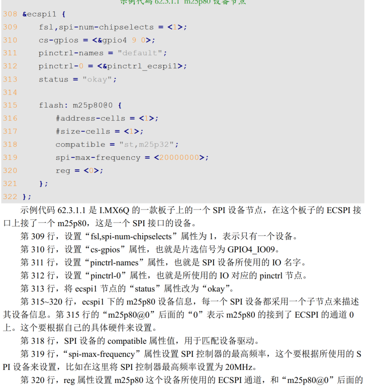


`spi_transfer`:描述spi传输信息

```c
struct spi_transfer {
        /* it's ok if tx_buf == rx_buf (right?)
        * for MicroWire, one buffer must be null
        * buffers must work with dma_*map_single() calls, unless
        * spi_message.is_dma_mapped reports a pre-existing mapping
        */
        const void *tx_buf;				//发送数据
        void *rx_buf;					//接收数据
        unsigned len;					//传输数据长度
        dma_addr_t tx_dma;
        dma_addr_t rx_dma;
        struct sg_table tx_sg;
        struct sg_table rx_sg;
        unsigned cs_change:1;
        unsigned tx_nbits:3;
        unsigned rx_nbits:3;
        #define SPI_NBITS_SINGLE 0x01 /* 1bit transfer */
        #define SPI_NBITS_DUAL 0x02 /* 2bits transfer */
        #define SPI_NBITS_QUAD 0x04 /* 4bits transfer */
        u8 bits_per_word;
        u16 delay_usecs;
        u32 speed_hz;
        struct list_head transfer_list;
};
```

`spi_transfer`需要组织成`spi_message`这个结构体,在使用`spi_message`这个结构体之前需要对其进行初始化,
使用相关函数如下

```c
/*
	初始化
	m： 要初始化的 spi_message。
	返回值： 无。
*/
void spi_message_init(struct spi_message *m)

/*
	添加spi_transfer到spi_message
    t： 要添加到队列中的 spi_transfer。
    m： spi_transfer 要加入的 spi_message。
    返回值： 无
*/
void spi_message_add_tail(struct spi_transfer *t, struct spi_message *m)

/*
	同步传输函数		阻塞等待数据传输完成
	spi： 要进行数据传输的 spi_device。
    message：要传输的 spi_message。
    返回值：0:传输成功,负数:传输失败。
*/
int spi_sync(struct spi_device *spi, struct spi_message *message)

/*
    异步传输	使用该函数需要配置spi_message中的complet函数,这是回调函数,数据发送完成后会被调用
    spi： 要进行数据传输的 spi_device。
    message：要传输的 spi_message。
    返回值： 0:传输成功,负数:传输失败。
*/
int spi_async(struct spi_device *spi, struct spi_message *message)
    
```

同步传输数据步骤

```c
①、申请并初始化 spi_transfer(需要用kzalloc申请内存空间)，设置 spi_transfer 的 tx_buf 成员变量， tx_buf 为要发送的数
据。然后设置 rx_buf 成员变量， rx_buf 保存着接收到的数据。最后设置 len 成员变量，也就是
要进行数据通信的长度。
②、使用 spi_message_init 函数初始化 spi_message。
③、使用 spi_message_add_tail 函数将前面设置好的 spi_transfer 添加到 spi_message 队列
中。
④、使用 spi_sync 函数完成 SPI 数据同步传输
```

​	当程序中用到了浮点运算的时候, 芯片支持浮点运算的时候,可以在编译的时候开启浮点运算

```shell
arm-linux-gnueabihf-gcc -march=armv7-a -mfpu=neon -mfloat-abi=hard icm20608App.c -o
icm20608App
```

### 设备控制接口（ioctl）

#### 应用层面

扩展 `file_opertations`中没有的函数时， 就需要用到`ioctl`函数，一些杂项函数就放在`ioctl`这个函数操作中

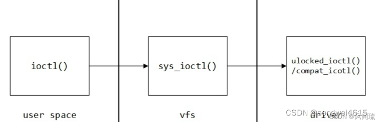

`unlocked_ioctl`: 一般就用这个,实现这个即可

`compat_ioctl` : 64位兼容（32位应用在64位内核）

```c
/*
*	
fd：文件描述符

request：命令码，应用程序通过下发命令码来控制驱动程序完成对应操作。

(…)arg：可变参数arg，一些情况下应用程序需要向驱动程序传参，参数就通过arg来传递。只能传递一个参数，但内核不会检查这个参数的类型。那么就有两种传参方式：只传一个整数，传递一个指针。

返回值：如果ioctl执行成功，它的返回值就是驱动程序中ioctl接口给的返回值，驱动程序可以通过返回值向用户程序传参。但驱动程序最好返回一个非负数，因为用户程序中的ioctl运行失败时一定会返回-1并设置全局变量errorno。
*/

int ioctl(int fd, unsigned long request, (...)arg);
```

#### 驱动层面

- unlocked_ioctl在无大内核锁（BKL）的情况下调用。64位用户程序运行在64位的kernel，或32位的用户程序运行在32位的kernel上，都是调用unlocked_ioctl函数。

```c
long (*unlocked_ioctl) (struct file * fp, unsigned int request, unsigned long args);
```

该函数体内部,通过一个`switch-case`结构,实现不同命令的对应操作

**ioctl命令格式**

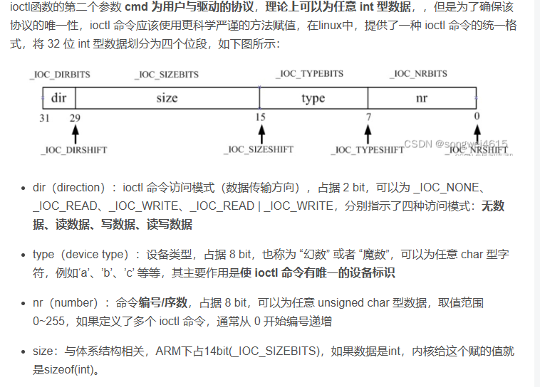

内核中有相关的宏定义,来构造`ioctl`命令

```c
#define _IOC(dir,type,nr,size) \
    (((dir)  << _IOC_DIRSHIFT) | \
     ((type) << _IOC_TYPESHIFT) | \
     ((nr)   << _IOC_NRSHIFT) | \
     ((size) << _IOC_SIZESHIFT))
```

依据上方宏定义衍生出以下宏定义

```c
#define _IO(type,nr)        _IOC(_IOC_NONE,(type),(nr),0)		//定义不带参数的命令
#define _IOR(type,nr,size)  _IOC(_IOC_READ,(type),(nr),(_IOC_TYPECHECK(size)))			//用户向驱动读参数
#define _IOW(type,nr,size)  _IOC(_IOC_WRITE,(type),(nr),(_IOC_TYPECHECK(size)))			//用户向驱动写参数
#define _IOWR(type,nr,size) _IOC(_IOC_READ|_IOC_WRITE,(type),(nr),(_IOC_TYPECHECK(size)))			//读写
```

**解析ioctl命令具体内容**

```c
#define _IOC_DIR(nr)        (((nr) >> _IOC_DIRSHIFT) & _IOC_DIRMASK)
#define _IOC_TYPE(nr)       (((nr) >> _IOC_TYPESHIFT) & _IOC_TYPEMASK)
#define _IOC_NR(nr)     (((nr) >> _IOC_NRSHIFT) & _IOC_NRMASK)
#define _IOC_SIZE(nr)       (((nr) >> _IOC_SIZESHIFT) & _IOC_SIZEMASK)

```

